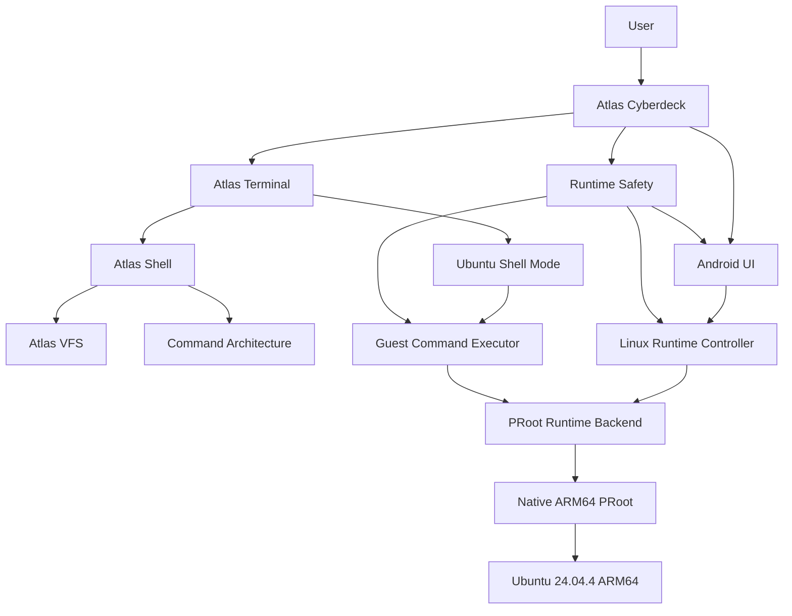

<div align="center">

# Atlas Labs

### **Independent Engineering. Serious Systems.**

Home of **Atlas Cyberdeck**

### **Your Cyberdeck. Anywhere.**

</div>

---

# About Atlas Labs

**Atlas Labs** is the independent development identity behind **Atlas Cyberdeck**.

It exists to build practical software with the discipline normally associated with much larger engineering teams:

- clear architecture;
- documented decisions;
- incremental validation;
- regression protection;
- security-aware design;
- long-term maintainability;
- professional product presentation.

Atlas Labs is not presented as a large company, department, or funded engineering organization.

The work is intentionally transparent:

> **Built independently by Noah Rose under Atlas Labs.**

The goal is not to look bigger than the project is.

The goal is to make the engineering strong enough that people naturally ask:

> **“This is a one-man project?”**

---

# Mission

Atlas Labs exists to build software that gives users more control over their own computing environment.

For Atlas Cyberdeck, that means bringing a serious Linux workspace to Android without requiring the user to surrender control of the device through rooting.

The broader mission is simple:

> **Build practical systems that are portable, understandable, extensible, and worthy of user trust.**

---

# Current Flagship Project

## Atlas Cyberdeck

**Atlas Cyberdeck** is a rootless Ubuntu Linux workspace and extensible cyberdeck platform for Android.

Current capabilities include:

- independent Atlas shell;
- persistent Atlas virtual filesystem;
- command registry and dispatcher architecture;
- scripting foundation;
- plugin foundation;
- native ARM64 PRoot runtime;
- Ubuntu 24.04.4 LTS ARM64 RootFS;
- persistent Ubuntu shell;
- Android DNS synchronization;
- `apt`, `apt-get`, and `dpkg`;
- Python 3.12.3;
- streamed Linux command execution;
- package transaction hardening;
- runtime diagnostics;
- fail-closed Safe Mode;
- controlled Recovery Mode;
- safety-aware UI;
- regression protection.

Current release:

```text
v0.13.0-alpha
```

Current product phase:

```text
Documentation & Product Readiness
```

Current engineering completion point:

```text
F3P-H5B
```

---

# Product North Star

> **A serious Linux workspace should be able to travel in your pocket without requiring you to surrender control of your Android device.**

That principle guides both product direction and architecture.

Atlas Cyberdeck is not intended to be a novelty terminal skin.

It is being built as a real mobile computing platform with explicit runtime ownership, persistent state, recoverable failure behavior, and room for future developer workflows.

---

# Engineering Philosophy

Atlas Labs development follows a simple principle:

> **Build the platform. Prove the runtime. Earn the trust.**

That means capability is not considered complete merely because code exists.

The normal engineering flow is:

```text
Design
  ↓
Implement
  ↓
Build
  ↓
Test
  ↓
Device Validation
  ↓
Lock
  ↓
Commit / Push
```

A phase should not be marked **LOCKED** until the relevant behavior has been validated.

---

# Core Principles

## 1. Build Real Capability

Features should solve actual technical problems.

Atlas Cyberdeck should not contain functionality merely because it looks impressive in screenshots.

If a feature is presented publicly, Atlas Labs should be able to demonstrate it.

---

## 2. Preserve User Trust

Persistent user data should not be treated as disposable.

The Linux runtime is designed around:

```text
preserve
diagnose
recover
verify
```

rather than:

```text
delete
reinstall
hope
```

where recovery is reasonably possible.

---

## 3. Fail Closed When Integrity Is Unknown

If the runtime safety state cannot be trusted, Atlas does not silently assume everything is fine.

Preferred rule:

> **Unknown integrity fails closed.**

This principle is implemented directly in the runtime safety model.

---

## 4. Keep System Boundaries Clear

Atlas Cyberdeck contains two primary shell environments:

```text
Atlas shell
Ubuntu guest shell
```

They interact, but they remain architecturally separate.

Atlas owns application behavior.

Ubuntu owns Linux userspace behavior.

---

## 5. Test Policy Independently

Critical safety rules should not require a physical device merely to determine whether a state transition is valid.

Where practical, core policy is extracted into pure JVM-testable logic.

Physical-device validation remains required for behavior involving Android, PRoot, Ubuntu, filesystem semantics, networking, and native process lifecycle.

---

## 6. Document the Engineering

Documentation is part of the product.

The repository should make it possible to understand:

- what Atlas is;
- how the major systems fit together;
- why important decisions were made;
- how Linux is launched;
- how safety works;
- how recovery works;
- how behavior is tested;
- where the product is going.

---

# Why Atlas Labs Exists

Atlas Labs gives the work a stable engineering identity.

A project like Atlas Cyberdeck spans multiple disciplines:

```text
Android
Kotlin
Jetpack Compose
Linux
PRoot
filesystem compatibility
process control
package management
networking
runtime safety
testing
documentation
product design
```

Keeping all of that under a consistent engineering identity helps prevent the project from feeling like a loose collection of experiments.

Atlas Labs is the place where those systems are brought together under one architecture and one standard.

---

# The Atlas Standard

Every major Atlas Labs artifact should meet four expectations.

## It should be understandable

Someone reading the code or documentation later should be able to determine:

- what the component owns;
- why it exists;
- what state it depends on;
- how it fails;
- how it is validated.

## It should be maintainable

Shortcuts that save a few minutes but create hidden coupling are not considered wins.

## It should be testable

Important behavior should have a realistic validation path.

## It should be presentable

The public repository should look intentional because the engineering is intentional.

---

# Current Technology Stack

Atlas Cyberdeck currently uses:

| Area | Technology |
|---|---|
| Language | Kotlin |
| Android UI | Jetpack Compose |
| Design System | Material 3 |
| State | ViewModel + StateFlow |
| Concurrency | Kotlin Coroutines |
| Build | Gradle |
| Unit Testing | JUnit |
| Linux Runtime | PRoot |
| Linux Guest | Ubuntu 24.04.4 LTS ARM64 |
| Package Tools | apt / apt-get / dpkg |
| Source Control | Git |
| CI | GitHub Actions |
| Hosting / Mirrors | GitHub + GitLab |

---

# Runtime Architecture



This architecture is intentionally layered.

No UI component should own the native Linux process directly.

No persisted repository flag should be treated as proof that PRoot is alive.

No safety warning should exist only as decoration without enforcement.

---

# Rootless by Design

Atlas Cyberdeck runs Ubuntu through PRoot.

Inside the Ubuntu guest:

```text
uid=0
```

may be presented.

That does not mean the Android device is rooted.

The Android application remains inside Android's application security model.

Preferred product wording:

> **Root inside Ubuntu. No Android root required.**

---

# Safety as a Product Feature

Runtime safety is not treated as a hidden internal implementation detail.

Current states:

```text
NORMAL
SAFE_MODE
RECOVERY_ARMED
```

User-facing names:

```text
Normal
Safe Mode
Recovery Mode
```

When the runtime experiences a serious integrity failure, Atlas can:

- persist the failure state;
- stop PRoot;
- clean transient runtime state;
- preserve RootFS and user data;
- block normal Linux startup;
- allow controlled recovery;
- verify repair before returning to Normal.

That behavior is intentionally visible in the application.

---

# Recovery Philosophy

Recovery should not pretend a failed operation succeeded.

For package repair, Atlas requires:

```text
approved repair operation
AND
exit code == 0
AND
post-repair package health == CLEAN
```

A clean audit alone is not enough.

This avoids false-positive recovery.

---

# Product Identity

Atlas Cyberdeck should be presented as:

> **A portable Linux workspace and extensible cyberdeck platform.**

It should not be marketed primarily as:

```text
a hacking app
a stealth tool
an anti-forensics platform
a phone rooting utility
```

The intended audience includes:

- developers;
- cybersecurity students;
- computer science students;
- IT professionals;
- Linux users;
- homelab users;
- field technicians;
- people who want a portable development environment.

---

# Visual Identity

Core product states currently use distinct visual meaning.

| Context | Identity |
|---|---|
| Atlas shell | Atlas application theme |
| Ubuntu shell | Black + Matrix green |
| Safe Mode | Black + yellow |
| Recovery Mode | Black + amber |
| Future Burner Mode | Black + red |

Safety identity takes priority over ordinary shell identity.

---

# Documentation Structure

Atlas Labs uses a layered documentation model.

```text
README.md
    → product overview

ATLAS_LABS.md
    → organization / founder / philosophy

docs/ROADMAP.md
    → product direction and phases

docs/ARCHITECTURE.md
    → high-level architecture

docs/CHANGELOG.md
    → notable release history

docs/STYLE_GUIDE.md
    → presentation and terminology rules

docs/adr/
    → architectural decisions

docs/engineering/
    → deep implementation documentation
```

---

# Architecture Decision Records

Major decisions are documented rather than buried in commit history.

Current ADR set includes:

```text
ADR-001 — Filesystem Architecture
ADR-002 — Terminal Architecture
ADR-003 — Persistence Strategy
ADR-004 — Testing Strategy
ADR-005 — Continuous Integration
ADR-006 — Linux Runtime Architecture
ADR-007 — PRoot Runtime
ADR-008 — Runtime Safety Model
ADR-009 — Controlled Recovery
ADR-010 — Atlas Shell vs Ubuntu Separation
```

---

# Engineering Documentation

Deep implementation documents include areas such as:

```text
Command Completion
Terminal Engines
Virtual Filesystem Orchestrator
Linux Runtime
Ubuntu RootFS
Guest Command Execution
Package Management
Runtime Networking
Runtime Safety
Runtime Recovery
Runtime Testing
```

The goal is to make important subsystem behavior discoverable without turning the README into a thousand-page engineering manual.

---

# Development Phases

Atlas development is organized using **phases**.

Current public roadmap direction includes:

```text
Platform Foundation
Atlas Shell & Filesystem
Ubuntu Linux Runtime
Networking & Package Management
Runtime Safety & Recovery
Regression Hardening
Documentation & Product Readiness
Pre-Launch Preparation
Remote Development & SSH
Git Workflows
Workspace Resilience
Extensibility
Atlas Cyberdeck 1.0
Commercial & Community Launch
Platform Expansion
Dedicated Hardware
```

Detailed internal engineering codes remain available for traceability.

---

# Current Status

The current Linux runtime program is **GREEN / LOCKED through H5B**.

That includes:

- real Ubuntu ARM64;
- native PRoot runtime;
- Linux start/stop;
- persistent Ubuntu shell;
- Android DNS sync;
- package management;
- package health checks;
- streaming command execution;
- Safe Mode;
- Recovery Mode;
- app-wide safety identity;
- command contract regression tests;
- pure safety state-machine tests.

Current work is focused on:

> **Documentation & Product Readiness**

---

# Product Readiness

Product readiness is not limited to making the app look good.

It includes:

- accurate README;
- accurate roadmap;
- current architecture documentation;
- changelog reconstruction;
- ADRs;
- engineering documentation;
- screenshots;
- real terminal examples;
- diagrams;
- release consistency;
- public terminology cleanup;
- professional repository presentation.

The goal is for the public project to reflect the quality of the underlying engineering.

---

# Pre-Launch Direction

Atlas Labs plans to prepare Atlas Cyberdeck for public pre-launch before Atlas 1.0.

Potential preparation includes:

- Atlas Labs website;
- product landing page;
- mailing list;
- device demo video;
- current screenshots;
- architecture visuals;
- founder story;
- early-access audience;
- crowdfunding feasibility;
- launch planning.

Public promises should remain limited to capabilities that can realistically be delivered and supported.

---

# Future Atlas Cyberdeck Areas

Planned or exploratory areas include:

```text
SSH
remote administration
Git workflows
workspace snapshots
backup / restore
expanded plugins
PTY support
tablet layouts
Chromebook support
desktop edition
dedicated cyberdeck hardware
```

These remain future work until explicitly implemented and validated.

---

# Commercial Philosophy

Atlas Labs may eventually support commercial product tiers.

Any future model should preserve a basic principle:

> **Core runtime safety should not become a premium-only feature.**

Potential future commercial work may explore:

```text
Free
Pro
Team / Education
Founder / Lifetime
```

Pricing and packaging are not considered final until validated later.

---

# Open Development

The Atlas repository is intended to show real engineering progress.

That means documenting:

- what works;
- what does not yet work;
- what is experimental;
- what is deferred;
- what was fixed after regression;
- what was validated on-device.

Credibility matters more than pretending development is always perfect.

---

# Professionalism Without Pretending

Atlas Labs does not need fake departments or inflated claims to appear serious.

Professionalism comes from:

```text
clean repository structure
consistent naming
good architecture
clear ADRs
useful engineering docs
real tests
device validation
accurate changelogs
polished screenshots
transparent limitations
```

That is the standard.

---

# Founder-Built

Atlas Cyberdeck is independently engineered by **Noah Rose** under Atlas Labs.

The project combines software-development practice, systems thinking, Linux experimentation, Android engineering, security design, and a long-term interest in portable computing.

The founder-built nature of Atlas is part of the project story, but it is not an excuse for lower engineering standards.

It is a reason to make the standards visible.

---

# What Atlas Labs Is Not

Atlas Labs should not be represented as:

- a multinational corporation;
- a large engineering department;
- a funded startup unless funding exists;
- a cybersecurity offensive-operations company;
- a hardware manufacturer before hardware exists;
- an enterprise vendor before the product reaches that maturity.

The identity should remain accurate as the project evolves.

---

# Repository Standard

Every major project document should answer one clear question.

| File | Question |
|---|---|
| `README.md` | What is Atlas Cyberdeck? |
| `ATLAS_LABS.md` | Who is building it and why? |
| `ROADMAP.md` | Where is it going? |
| `ARCHITECTURE.md` | How do the major systems fit together? |
| `CHANGELOG.md` | What changed? |
| `STYLE_GUIDE.md` | How should Atlas be presented? |
| ADRs | Why were major decisions made? |
| Engineering docs | How do specific subsystems work? |

---

# Quality Gate

Before a phase is considered complete, Atlas Labs should ask:

```text
Does it build?
Does it test?
Does it work on-device?
Does the state model make sense?
Does failure behave safely?
Is the behavior documented?
Can the result be explained clearly?
```

If the answer to a critical question is no, the phase is not finished.

---

# Long-Term Vision

Atlas Labs is not limited to one Android application.

The larger direction is a family of portable computing tools built around user control and serious engineering.

Atlas Cyberdeck is the first platform.

Possible future directions include:

- larger-screen Atlas environments;
- desktop/mobile workflow continuity;
- dedicated cyberdeck hardware;
- secure remote-development workflows;
- portable workspaces;
- modular Atlas extensions.

These directions remain exploratory until the current platform earns the right to expand.

---

# Brand Lines

Primary product tagline:

> **Your Cyberdeck. Anywhere.**

Engineering philosophy:

> **Build the platform. Prove the runtime. Earn the trust.**

Project North Star:

> **A serious Linux workspace should be able to travel in your pocket without requiring you to surrender control of your Android device.**

Founder/project quote:

> *"Maybe not breaking free from the Matrix—but we are writing our own code instead of living inside someone else's. That is a pretty good way to spend our time."*

---

<div align="center">

## Atlas Labs

**Independent Engineering • Portable Systems • User Control**

### **Atlas Cyberdeck**

**v0.13.0-alpha**

### **Your Cyberdeck. Anywhere.**

<br>

**Built independently by Noah Rose under Atlas Labs.**

</div>
