<div align="center">

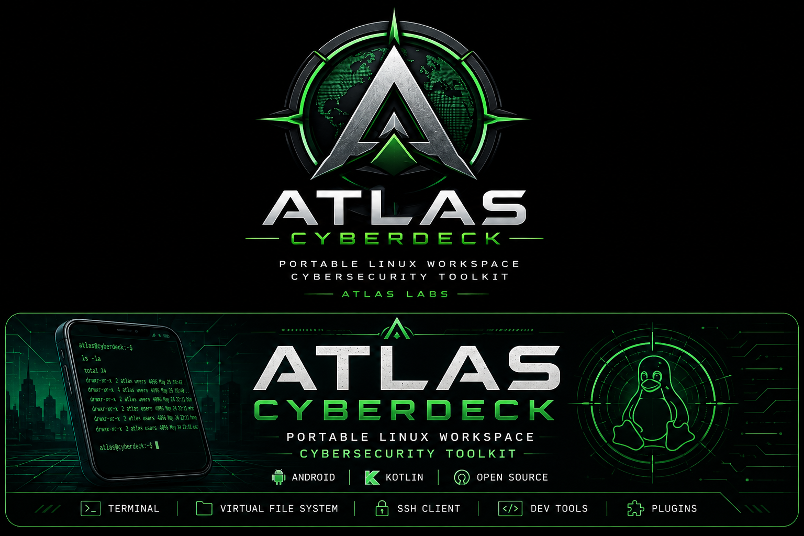

# Atlas Cyberdeck

### Your Cyberdeck. Anywhere.

**A rootless Ubuntu Linux workspace and extensible cyberdeck platform for Android.**

<br>


</div>

---

## What is Atlas Cyberdeck?

**Atlas Cyberdeck** is an open-source Android application developed by **Atlas Labs** that combines two environments inside one mobile platform:

- the **Atlas shell**, with its own terminal, scripting, virtual filesystem, commands, plugins, and diagnostics;
- a **real Ubuntu ARM64 userspace**, launched through PRoot without requiring Android root access.

Atlas is being built for developers, cybersecurity students and professionals, system administrators, homelab users, and anyone who wants a capable Linux workspace available from an Android device.

> **Atlas is not just a terminal emulator.**  
> It manages a persistent Linux environment, runtime lifecycle, package operations, diagnostics, recovery state, and safety controls as part of the application itself.

---

## Project Status

Atlas Cyberdeck is currently in active alpha development.

The project already runs a persistent Ubuntu ARM64 userspace on Android through PRoot without requiring device root access. Core runtime control, package management, diagnostics, Safe Mode, controlled recovery, and the Atlas terminal are operational and under active testing.

Atlas Cyberdeck is currently under Kickstarter review. Crowdfunding, if approved and successfully funded, will support continued development toward a polished public release, expanded platform capabilities, broader device validation, documentation, and the path toward Atlas Cyberdeck 1.0.

> **This is working software, not a concept render.**  
> The screenshots and terminal output in this repository are from the current Atlas Cyberdeck development build.

---

## Atlas at a Glance

| 🐧 **Ubuntu Runtime** | 💻 **Atlas Platform** | 🛡️ **Runtime Safety** |
|---|---|---|
| Ubuntu 24.04.4 LTS | Native Atlas shell | Fail-closed circuit breaker |
| ARM64 / AArch64 | Persistent virtual filesystem | Safe Mode |
| Rootless PRoot runtime | `.ash` scripting | Controlled Recovery |
| Persistent root filesystem | Pipelines, aliases, history | Recovery command policy |
| `apt`, `apt-get`, `dpkg` | Diagnostics and status | Package-state protection |
| Android root not required | Plugin framework foundation | App-wide safety identity |

---

# Real Ubuntu. No Android Root.

Atlas can start its Linux runtime and enter a persistent Ubuntu shell directly from the Atlas terminal.

<p align="center">
  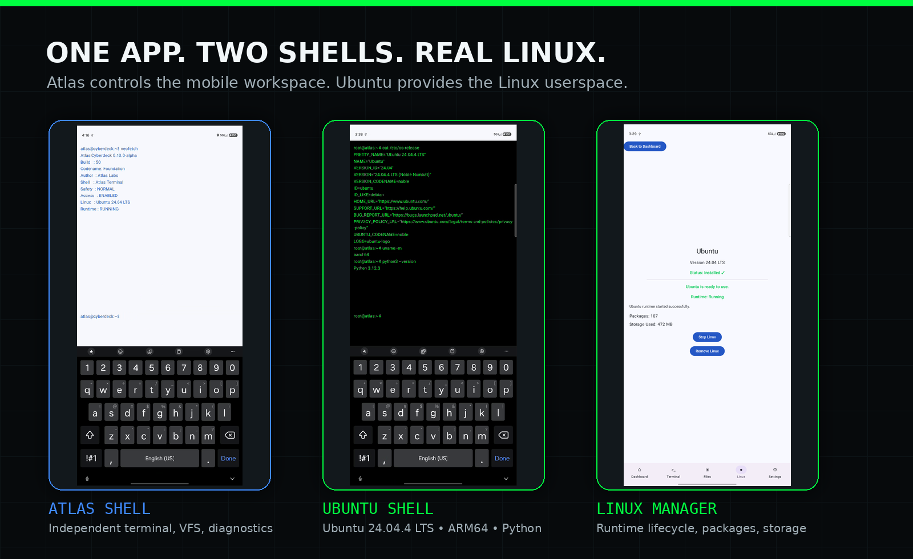
</p>

### Start the runtime

```console
atlas@cyberdeck:~$ linux start
Linux runtime started.
```

### Enter Ubuntu

```console
atlas@cyberdeck:~$ linux shell
Ubuntu shell mode enabled.
Type 'exit' to return to Atlas.

root@atlas:~#
```

### Run Linux tools

```console
root@atlas:~# python3 --version
Python 3.12.3

root@atlas:~# uname -m
aarch64
```

### Return to Atlas

```console
root@atlas:~# exit
Welcome back to Atlas shell.

atlas@cyberdeck:~$
```

### Linux runtime controls

```text
linux status
linux start
linux stop
linux shell
```

---

## Runtime Stack

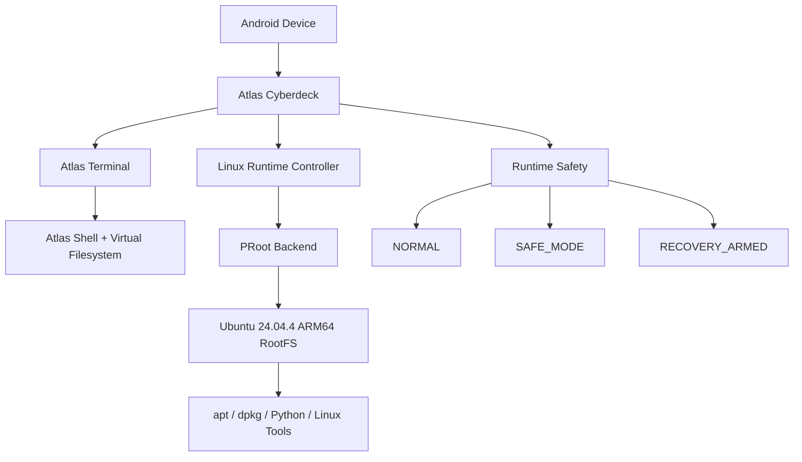

The Atlas environment and Ubuntu environment are intentionally separate. Atlas owns application-level state, runtime control, diagnostics, and safety; Ubuntu provides the Linux userspace.

---

# Built to Fail Safely

Running a Linux userspace inside Android creates failure modes that ordinary terminal apps do not have to manage. Atlas treats runtime integrity as a first-class system concern.

| State | Runtime Access | Purpose |
|---|---|---|
| 🟢 **NORMAL** | Enabled | Standard Linux operation |
| 🟡 **SAFE_MODE** | Blocked | Fail closed after a serious runtime, filesystem, package, or integrity failure |
| 🟠 **RECOVERY_ARMED** | Recovery only | Allow controlled repair while restricting guest commands |

<p align="center">
  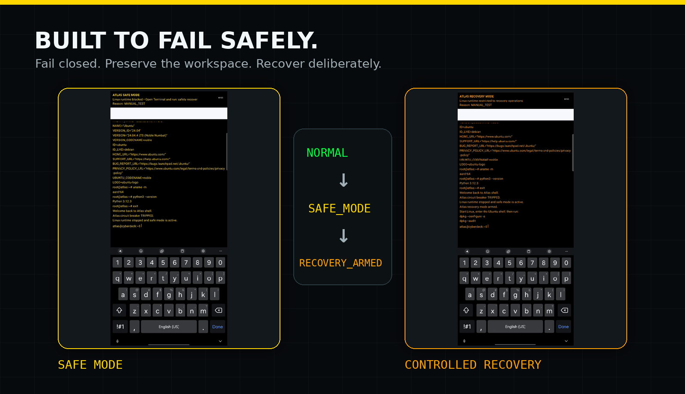
</p>

### Safety commands

```text
safety status
safety recover
safety trip-test
safety reset --force
```

When the circuit breaker trips, Atlas can:

- stop the active PRoot runtime;
- block normal Linux startup;
- clean only disposable transient runtime state;
- preserve the Ubuntu root filesystem;
- preserve user files;
- preserve package databases and metadata;
- persist the safety condition;
- require verified recovery before returning to normal operation.

Core safety protections are part of the platform architecture rather than optional convenience features.

---

## Package Management

Ubuntu package management is available through standard Debian tools.

```console
root@atlas:~# apt update
...

root@atlas:~# apt install -y python3
...

root@atlas:~# python3 --version
Python 3.12.3
```

Atlas adds protections around package transactions, including health checks and package-state auditing, so a failed package operation cannot silently be treated as a successful recovery.

---

# Atlas Terminal

The Atlas terminal is its own shell environment and remains available independently of Ubuntu.

### Current capabilities

- command history and recall;
- aliases;
- environment variables;
- wildcard expansion;
- hardware keyboard Tab completion;
- pipelines;
- registry-driven command metadata;
- modular command handlers;
- Atlas `.ash` scripts;
- plugin discovery;
- system and runtime diagnostics.

<details>
<summary><strong>Show common Atlas commands</strong></summary>

<br>

```text
cat
cd
clear
cp
diagnostics
echo
find
grep
head
help
history
linux
ls
mkdir
mv
neofetch
plugins
pwd
rm
rmdir
runscript
safety
sort
status
tail
touch
tree
uniq
version
wc
whoami
```

</details>

---

## Persistent Virtual Filesystem

Atlas includes a virtual filesystem that is independent of the Ubuntu guest filesystem.

Current capabilities include:

- persistent filesystem state;
- directory navigation;
- file creation, reading, writing, copying, moving, and deletion;
- directory creation and removal;
- relative paths;
- filesystem searching;
- tree visualization;
- working-directory tracking.

This separation allows Atlas shell workflows to remain stable whether the Ubuntu runtime is running or stopped.

---

## Atlas Shell Scripts

Atlas supports an early shell scripting format using `.ash` files.

```text
mkdir Project
cd Project
touch hello.txt
echo Atlas Cyberdeck > hello.txt
cat hello.txt
pwd
ls
```

Run the script with:

```console
atlas@cyberdeck:~$ runscript example.ash
```

The scripting engine reuses the Atlas command-processing pipeline and maintains shell/filesystem state between commands.

---

# Diagnostics

Atlas exposes application, runtime, architecture, and safety information through built-in commands.

```console
atlas@cyberdeck:~$ diagnostics
```

Diagnostics can report:

| Area | Examples |
|---|---|
| Atlas | Version, command registry, handlers, plugins |
| Storage | Filesystem and runtime-storage state |
| Linux | Installation, runtime, assets, ABI |
| Safety | Mode, reason, runtime access, cleanup state |
| Device | Device profile and runtime capability |
| Overall | Healthy, degraded, safe mode, or recovery state |

Quick status commands:

```text
status
neofetch
version
diagnostics
```

---

# Visual Runtime Identity

Atlas visually distinguishes the active environment.

| Environment | Identity |
|---|---|
| **Atlas Shell** | Atlas application theme |
| **Ubuntu Shell** | Black + Matrix green |
| **Safe Mode** | Black + yellow |
| **Recovery Mode** | Black + amber |

Safety identity takes precedence over normal shell identity so the user can immediately recognize when the runtime is restricted.

---

# Screenshots

<p align="center">
  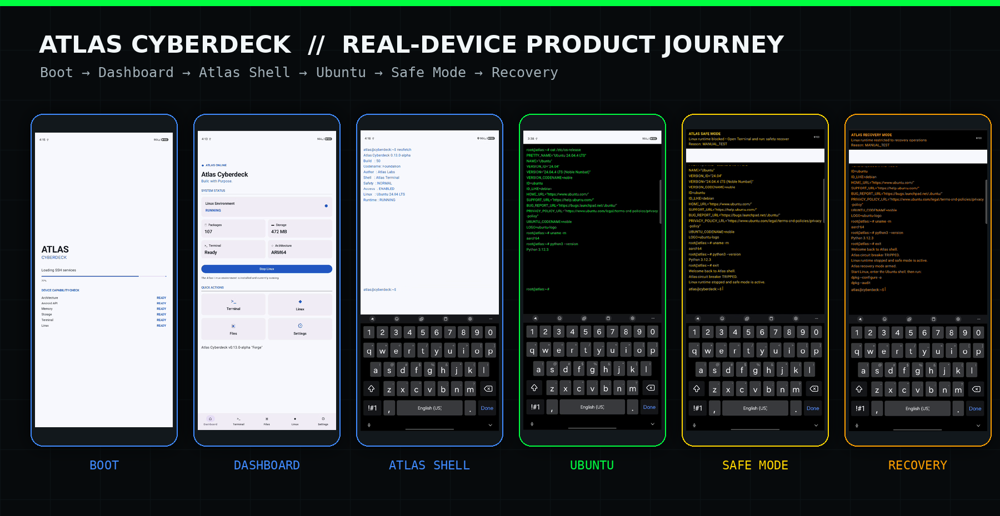
</p>

<table>
<tr>
<td width="50%" align="center">
<strong>Dashboard — Linux Running</strong><br><br>
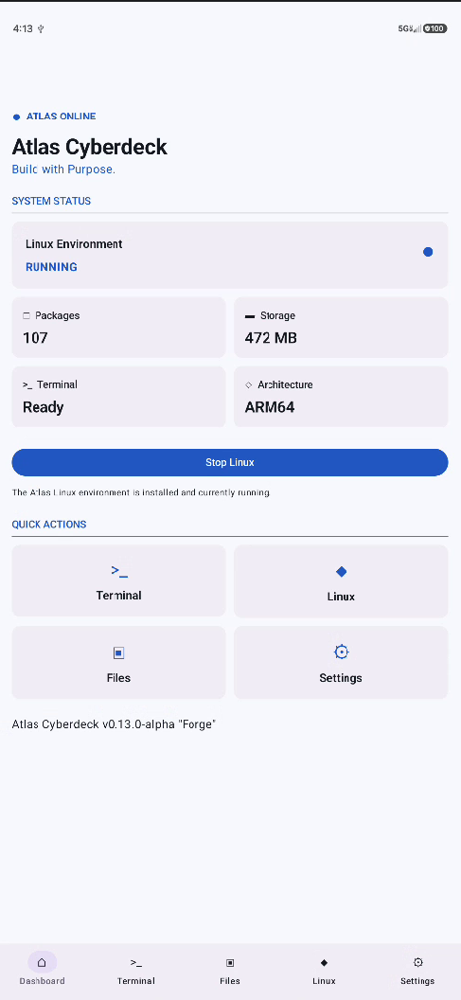
</td>
<td width="50%" align="center">
<strong>Ubuntu 24.04.4 LTS on Android</strong><br><br>
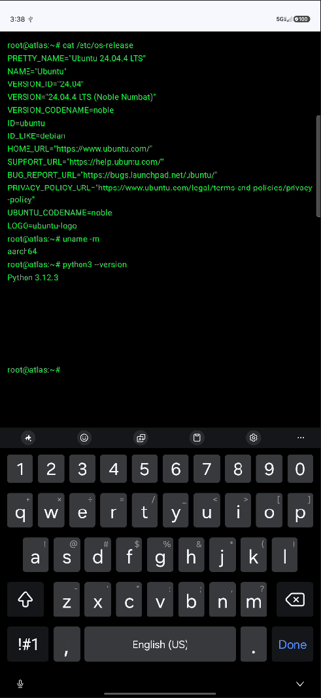
</td>
</tr>
<tr>
<td width="50%" align="center">
<strong>Atlas Terminal</strong><br><br>
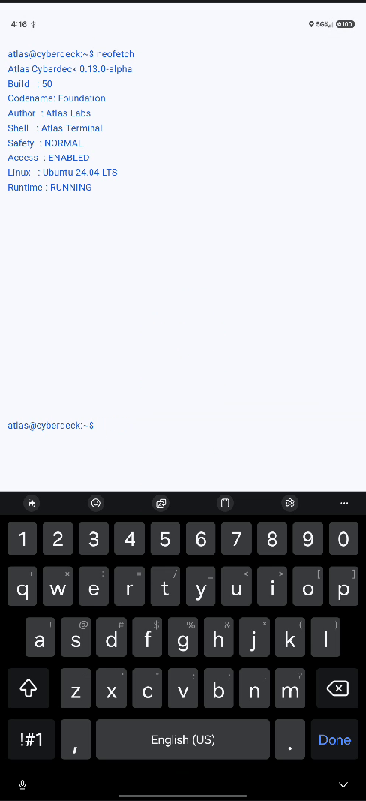
</td>
<td width="50%" align="center">
<strong>Linux Manager</strong><br><br>
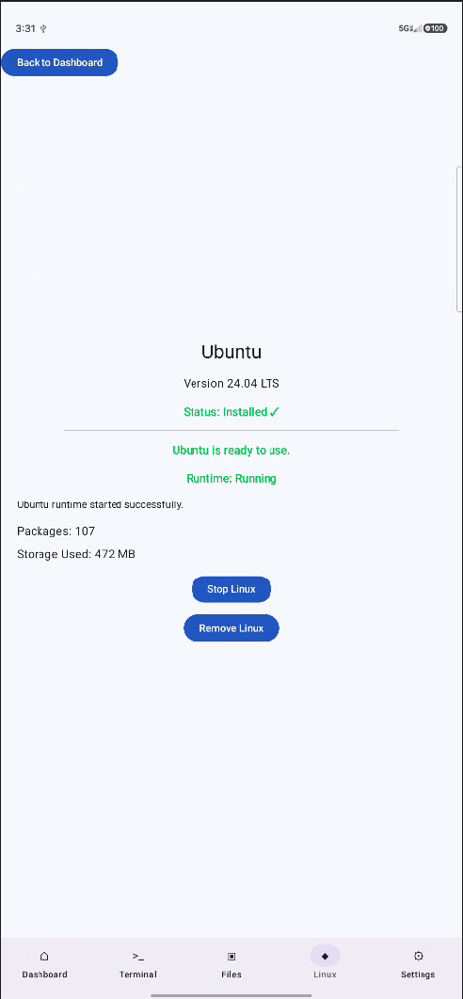
</td>
</tr>
<tr>
<td width="50%" align="center">
<strong>Safe Mode</strong><br><br>
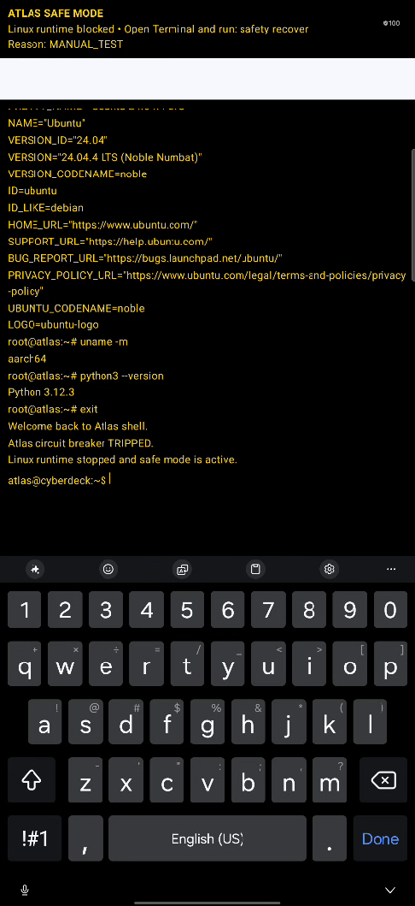
</td>
<td width="50%" align="center">
<strong>Controlled Recovery</strong><br><br>
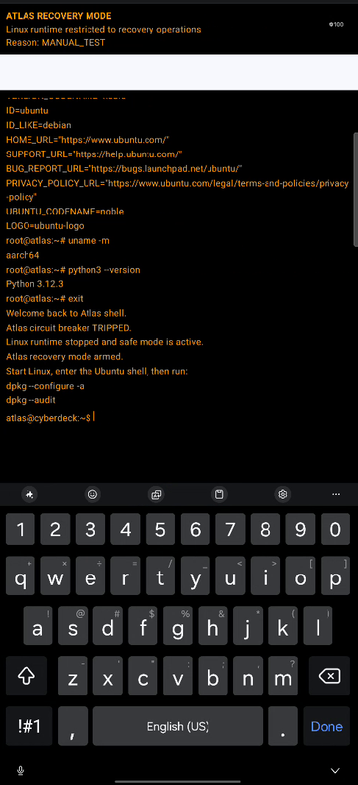
</td>
</tr>
</table>

<details>
<summary><strong>Additional real-device captures</strong></summary>

<br>

<table>
<tr>
<td width="50%" align="center">
<strong>Boot Experience</strong><br><br>
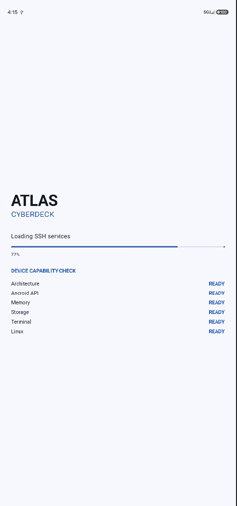
</td>
<td width="50%" align="center">
<strong>Clean Ubuntu Runtime Capture</strong><br><br>
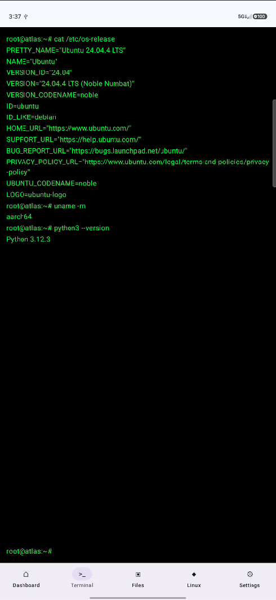
</td>
</tr>
</table>

</details>

---

# Architecture

Atlas Cyberdeck is organized around clear boundaries between the Android application, Atlas shell, Linux runtime, and runtime-safety systems.

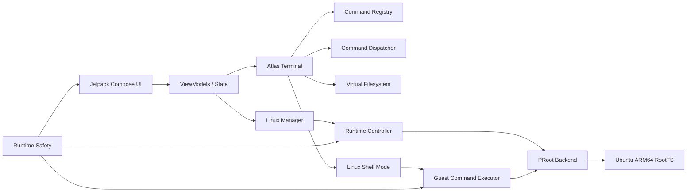

### Major components

```text
Atlas Cyberdeck
│
├── Android UI
│
├── Atlas Terminal
│   ├── Command Registry
│   ├── Command Dispatcher
│   ├── Command Handlers
│   ├── Command History
│   ├── Alias Resolution
│   ├── Variable Expansion
│   ├── Wildcard Expansion
│   ├── Pipe Engine
│   ├── Script Engine
│   └── Plugin Framework
│
├── Atlas Virtual File System
│
├── Linux Runtime
│   ├── Runtime Controller
│   ├── Runtime Backend
│   ├── PRoot Process Launcher
│   ├── Ubuntu ARM64 RootFS
│   ├── Guest Command Executor
│   ├── Persistent Shell Mode
│   ├── Package Command Policy
│   ├── DNS Synchronization
│   └── Runtime Diagnostics
│
└── Runtime Safety
    ├── Circuit Breaker
    ├── Safety State Machine
    ├── Safe Mode
    ├── Recovery Mode
    └── Recovery Policy
```

For deeper engineering documentation, see [`docs/ARCHITECTURE.md`](docs/ARCHITECTURE.md).

---

# Current Release

<div align="center">

## v0.13.0-alpha

**Linux Runtime Foundation + Runtime Safety Hardening**

</div>

| Capability | Status |
|---|:---:|
| Ubuntu ARM64 root filesystem | ✅ |
| Rootless PRoot execution | ✅ |
| Persistent Ubuntu shell | ✅ |
| Package management | ✅ |
| Android-to-Linux DNS synchronization | ✅ |
| Streaming guest command execution | ✅ |
| Package transaction hardening | ✅ |
| Runtime circuit breaker | ✅ |
| Safe Mode | ✅ |
| Controlled Recovery | ✅ |
| Safety diagnostics | ✅ |
| Safety-aware UI | ✅ |
| Linux command regression tests | ✅ |
| Safety state-machine unit tests | ✅ |

> Atlas Cyberdeck is **alpha software**. Interfaces, implementation details, and runtime behavior may continue to change before 1.0.

---

# Testing

Atlas uses automated tests plus physical-device validation for runtime-critical work.

### Unit tests

```bash
./gradlew testDebugUnitTest
```

### Debug build

```bash
./gradlew assembleDebug
```

### Install on a connected device

```bash
./gradlew installDebug
```

Current regression coverage includes Linux command contracts, package policy, runtime access rules, recovery behavior, and pure safety-state transitions.

---

# Technology

| Application | Runtime | Engineering |
|---|---|---|
| Kotlin | PRoot | Gradle |
| Jetpack Compose | Ubuntu ARM64 | JUnit |
| Material 3 | Debian package tools | Git |
| ViewModel | Native ARM64 libraries | GitHub |
| StateFlow | Android DNS integration | GitLab |
| Coroutines | Persistent RootFS | GitHub Actions |

The Android namespace currently remains:

```text
com.noahrose.pocketlab
```

while the product continues its architectural migration to Atlas Cyberdeck branding.

---

# Development Model

Atlas development is organized into **engineering phases** rather than large monolithic releases.

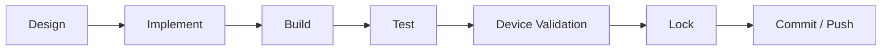

Each phase is kept small enough to validate before the next system layer is added.

---

# Roadmap

Atlas Cyberdeck development is organized into engineering phases. Current planned directions include:

- expanded Linux runtime capabilities;
- SSH client;
- Git integration;
- extended plugin architecture;
- expanded Atlas scripting;
- networking utilities;
- workspace snapshots and recovery;
- broader automated test coverage;
- Android tablet optimization;
- Chromebook optimization;
- desktop edition;
- Atlas Cyberdeck 1.0;
- dedicated cyberdeck hardware.

See [`docs/ROADMAP.md`](docs/ROADMAP.md) for the detailed roadmap.

---

# Documentation

| Document | Purpose |
|---|---|
| [`ARCHITECTURE.md`](docs/ARCHITECTURE.md) | System architecture and component boundaries |
| [`ROADMAP.md`](docs/ROADMAP.md) | Development phases and future work |
| [`CHANGELOG.md`](docs/CHANGELOG.md) | Release and implementation history |
| [`docs/adr/`](docs/adr/) | Architecture Decision Records |
| [`docs/engineering/`](docs/engineering/) | Deep engineering documentation |
| [`SECURITY.md`](SECURITY.md) | Security reporting policy |
| [`CONTRIBUTING.md`](CONTRIBUTING.md) | Contribution guidelines |
| [`CODE_OF_CONDUCT.md`](CODE_OF_CONDUCT.md) | Community expectations |

---

# Contributing

Ideas, bug reports, documentation improvements, feature proposals, and pull requests are welcome.

Please review [`CONTRIBUTING.md`](CONTRIBUTING.md) before submitting changes.

---

# Security

Please report security issues according to [`SECURITY.md`](SECURITY.md).

Do not publicly disclose a vulnerability before it has had a reasonable opportunity to be reviewed and addressed.

---

# License

Atlas Cyberdeck is released under the **MIT License**.

See [`LICENSE`](LICENSE) for details.

---

<div align="center">

## Atlas Labs

Atlas Cyberdeck is developed by **Atlas Labs** with an emphasis on clean architecture, security, portability, maintainability, and long-term extensibility.

The long-term goal is to build a modular portable computing platform for Linux tooling, development workflows, cybersecurity labs, scripting, automation, remote administration, extensible modules, and eventually dedicated cyberdeck hardware.

<br>

> *"Maybe not breaking free from the Matrix—but we are writing our own code instead of living inside someone else's. That is a pretty good way to spend our time."*

<br>

### **Atlas Cyberdeck**
### **Your Cyberdeck. Anywhere.**

**v0.13.0-alpha**

</div>
