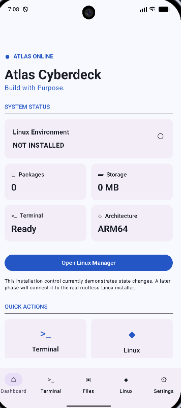
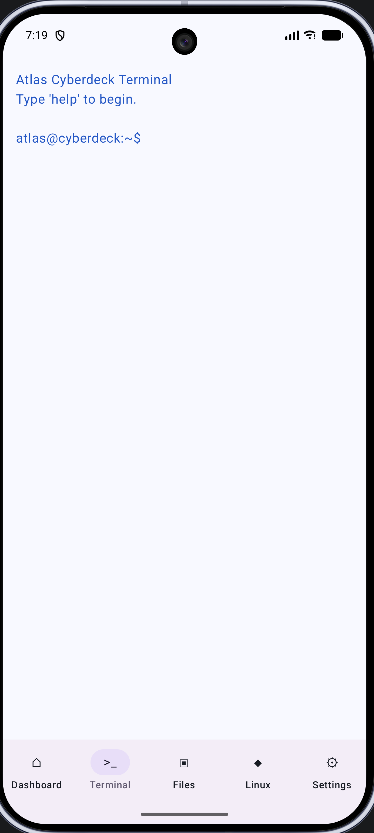
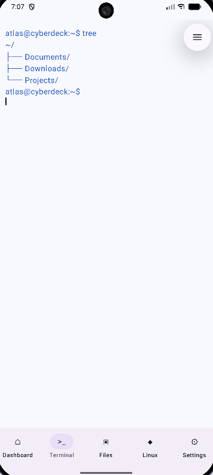
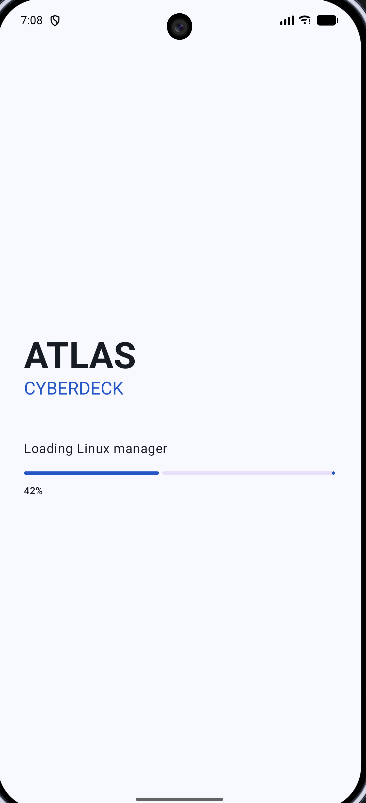

# Atlas Cyberdeck

> **Portable Linux Workspace • Cybersecurity Toolkit • Android • Kotlin**

---

## Overview

Atlas Cyberdeck is an open-source Android application developed by Atlas Labs that brings a Linux-inspired workspace to mobile devices.

The project combines a virtual terminal, virtual filesystem, and modular architecture into a portable platform designed for developers, system administrators, cybersecurity professionals, and technology enthusiasts.

Atlas Cyberdeck is built with modern Android development practices and designed to grow into a complete portable cyberdeck platform.

---

## Current Features

### Terminal

- Linux-style shell
- Command history
- Command aliases
- Environment variables
- Wildcard expansion
- Hardware keyboard Tab completion
- Command pipelines
- `grep`
- `head`
- `tail`

### Virtual File System

- Directory navigation
- File creation
- File deletion
- File reading
- File writing
- Directory creation
- Directory deletion
- File copy
- File move
- Tree view

### User Interface

- Material 3
- Multi-screen navigation
- Dashboard
- Boot screen
- Linux workspace foundation

---

## Screenshots

### Dashboard

### Terminal

### Virtual File System

### Boot Screen

---

## Technology

- Kotlin
- Jetpack Compose
- Material 3
- Android ViewModel
- StateFlow
- Gradle

---

## Project Status

_Current milestone:_

**v0.13.0-alpha — Foundation**

Current focus:

- Filesystem architecture
- Terminal improvements
- Documentation
- Version 1.0 preparation

---

## Documentation

Additional documentation is available in this repository.

- Architecture
- Roadmap
- Changelog
- Architecture Decision Records
- Security Policy
- Contributing Guide
- Code of Conduct

---

## Roadmap

Planned features include:

- Persistent virtual filesystem
- SSH client
- Rootless Linux runtime
- Git integration
- Plugin framework
- Desktop edition
- Dedicated cyberdeck hardware

---

## Contributing

Ideas, feature requests, bug reports, and pull requests are welcome.

Please review the contributing guidelines before submitting changes.

---

## License

Released under the MIT License.

---

## Atlas Labs

Atlas Cyberdeck is developed by Atlas Labs with a focus on clean architecture, maintainable software, and long-term extensibility.

---

> *"Maybe not breaking free from the Matrix—but we are writing our own code instead of living inside someone else's."*