<div align="center">

# Atlas Cyberdeck — Architecture

### **Your Cyberdeck. Anywhere.**

**Android Application • Atlas Shell • Rootless Ubuntu ARM64 • Runtime Safety**

**Current release:** `v0.13.0-alpha`

</div>

---

# 1. Purpose

This document describes the high-level software architecture of **Atlas Cyberdeck**, including:

- Android application structure
- Atlas shell architecture
- virtual filesystem
- Linux runtime
- PRoot integration
- Ubuntu RootFS
- guest command execution
- interactive PTY terminal architecture
- terminal rendering and native PTY input
- package-management safeguards
- runtime safety
- recovery behavior
- testing strategy
- continuous integration
- long-term architectural direction

Atlas Cyberdeck is designed as a modular platform rather than a single terminal screen wrapped around a Linux process.

The application deliberately separates the **Atlas environment** from the **Ubuntu guest environment** so that Android application state, Linux runtime state, user workflows, diagnostics, and safety controls remain understandable and testable.

---

# 2. Architectural Goals

Atlas Cyberdeck is built around six primary architectural goals.

| Goal | Description |
|---|---|
| **Separation of concerns** | UI, terminal, Linux runtime, persistence, and safety are kept in distinct layers |
| **Fail-safe behavior** | Runtime integrity failures must fail closed instead of silently continuing |
| **Testability** | Critical policy should be testable without requiring a physical Android device |
| **Maintainability** | Components should have narrow responsibilities and explicit contracts |
| **Extensibility** | New commands, plugins, runtime features, and future platforms should fit existing boundaries |
| **Portability** | Atlas should evolve beyond one screen size, one workflow, or one device class |

---

# 3. System Overview

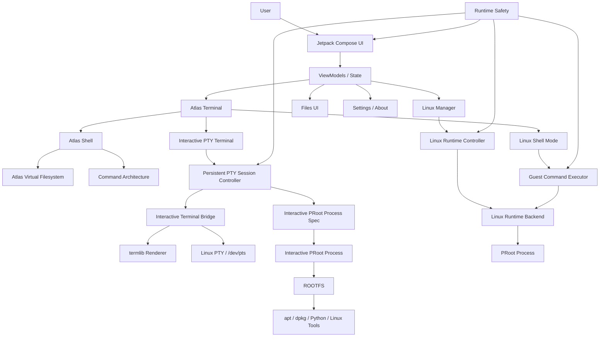

The architecture contains two distinct user environments:

```text
Atlas Environment
    ├── Atlas shell
    ├── Atlas commands
    ├── Atlas virtual filesystem
    ├── scripting
    ├── plugins
    ├── diagnostics
    └── application-level controls

Ubuntu Environment
    ├── Ubuntu 24.04.4 LTS ARM64
    ├── PRoot userspace
    ├── Linux filesystem
    ├── apt / dpkg
    ├── Python
    ├── finite guest Linux commands
    └── interactive PTY applications
```

These environments interact, but they are not the same system.

---

# 4. Android Application Layer

Atlas Cyberdeck is a native Android application written in Kotlin.

## Core technologies

```text
Kotlin
Jetpack Compose
Material 3
Android ViewModel
StateFlow
Coroutines
Gradle
JUnit
```

The Android layer owns:

- application lifecycle
- navigation
- UI state
- runtime initialization
- device capability detection
- Linux installation controls
- runtime controls
- safety-state presentation
- app-wide status
- interactive-terminal UI attachment
- persistent application settings
- product-facing About / credits / licenses presentation

---

# 5. UI Architecture

The user interface is implemented with **Jetpack Compose** and follows state-driven rendering.

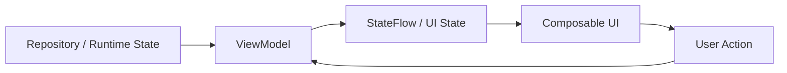

This design keeps runtime logic out of Composables.

## Major screens

```text
Dashboard
Terminal
Linux Manager
Files
Settings / About
Boot Experience
```

## UI responsibility

The UI should:

- render authoritative state
- collect observable state
- submit user intent
- avoid owning Linux process state directly
- avoid duplicating runtime policy
- avoid bypassing safety gates

---

# 6. Atlas Shell Architecture

The Atlas shell is an application-level shell environment implemented independently of Ubuntu.

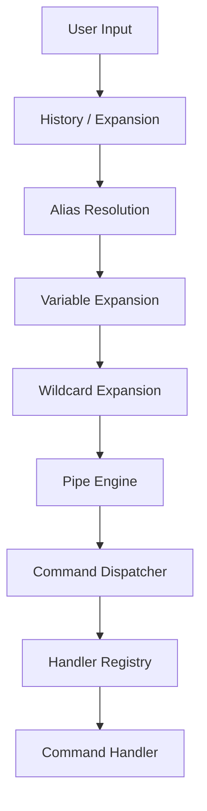

## Core terminal components

```text
Command Registry
Command Dispatcher
Handler Registry
Command History
Alias Resolution
Variable Expansion
Wildcard Expansion
Command Completion
Pipe Engine
Script Engine
Plugin Framework
```

### Architectural rule

> **The Atlas shell is not a wrapper around Ubuntu.**

Atlas commands such as:

```text
whoami
pwd
ls
status
diagnostics
plugins
runscript
```

operate within the Atlas application environment unless Linux shell mode is explicitly active.

---

# 7. Command Architecture

Atlas uses registry-driven commands instead of a single monolithic command parser.

## Command Registry

The registry provides shared command metadata used by:

- help
- command discovery
- completion
- dispatch
- diagnostics

## Command Dispatcher

The dispatcher routes parsed command input to the appropriate handler.

## Handler Registry

Handlers group command behavior by responsibility rather than placing every command in one file.

Current handler families include concepts such as:

```text
Utility
File
Directory
Text
Linux
```

This architecture makes commands easier to extend, test, and reorganize.

---

# 8. Atlas Virtual Filesystem

Atlas maintains a persistent virtual filesystem separate from the Ubuntu RootFS.

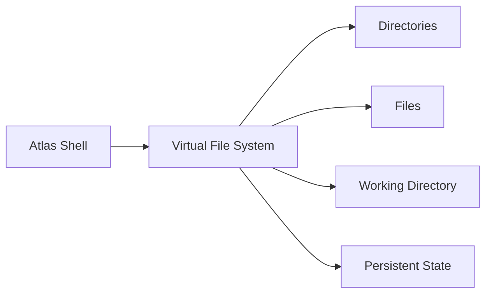

## Current capabilities

- persistent filesystem state
- path navigation
- relative paths
- file creation
- file reading
- file writing
- copy
- move
- rename
- deletion
- directory creation
- directory removal
- search
- tree visualization

### Design purpose

The Atlas virtual filesystem allows shell workflows to remain available even when:

- Ubuntu is not installed
- Ubuntu is stopped
- Linux is unavailable on a device
- the runtime is in Safe Mode

---

# 9. Atlas Script Engine

Atlas supports early `.ash` script execution.

```text
example.ash
```

A script is processed through the same Atlas command architecture used by interactive commands.

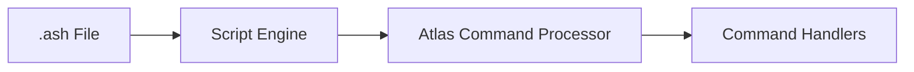

This avoids creating a second independent execution path for scripted commands.

---

# 10. Plugin Architecture

Atlas includes a plugin framework foundation.

Current architectural concepts include:

```text
TerminalPlugin
Plugin Metadata
PluginRegistry
Plugin Initialization
Built-In Plugin Registration
Plugin Discovery
```

Dynamic third-party loading is not yet part of the current release.

The long-term intent is to allow Atlas features to grow modularly without forcing every capability into the core application.

---

# 11. Linux Runtime Architecture

The Linux runtime is the most complex subsystem in Atlas Cyberdeck.

It is responsible for providing a functional Ubuntu ARM64 environment inside Android without requiring Android root access.

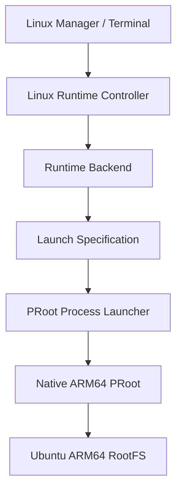

## Runtime responsibilities

The runtime system owns:

- installation state
- capability checks
- runtime status
- session state
- process startup
- process shutdown
- RootFS location
- native runtime assets
- ABI validation
- finite guest command execution
- interactive PTY process execution
- process-health reconciliation

---

# 12. Runtime Controller

The **Linux Runtime Controller** acts as the primary application-side authority for starting and stopping Linux.

The controller should not assume that repository state alone proves that the Linux process is alive.

It coordinates:

```text
Safety Gate
    ↓
Installation State
    ↓
Device Capability
    ↓
Backend
    ↓
Runtime Process
    ↓
Session State
```

### Safety rule

The controller checks runtime safety before allowing a normal start.

If Atlas is in `SAFE_MODE`, normal startup must be blocked even if Linux is installed and otherwise healthy.

---

# 13. Runtime Backend

The runtime backend separates application control logic from implementation-specific runtime behavior.

This makes the runtime controller depend on an abstraction instead of directly managing PRoot details.

Conceptually:

```text
LinuxRuntimeController
        │
        ▼
LinuxRuntimeBackend
        │
        ▼
ProotLinuxRuntimeBackend
```

This boundary is important for:

- testing
- future runtime experimentation
- architecture stability
- avoiding UI/process coupling

---

# 14. Native PRoot Layer

Atlas packages a native ARM64 PRoot runtime inside the Android application.

Current runtime:

```text
PRoot        : 5.1.107.92
Architecture : ARM64
Android Root : Not required
```

The native runtime is provisioned and validated before launch.

## Native runtime concerns

- ABI compatibility
- binary availability
- runtime provenance
- executable paths
- loader support
- process launch
- runtime integrity

---

# 15. Ubuntu RootFS

Atlas uses an Ubuntu ARM64 root filesystem.

Current environment:

```text
Distribution : Ubuntu 24.04.4 LTS
Architecture : ARM64 / AArch64
Home         : /root
Guest UID    : 0
```

The RootFS is persistent.

Atlas does not treat the Linux environment as a disposable temporary shell unless a future explicitly disposable workspace feature is selected.

---

# 16. PRoot Launch Environment

The PRoot launch specification isolates Android host requirements from Ubuntu guest expectations.

Key launch concepts include:

```text
--kill-on-exit
--link2symlink
-L
-0
-r <rootfs>
-b /dev
-b /proc
-b /sys
-w /root
/bin/sh
-l
```

Key environment concepts include:

```text
PROOT_L2S_DIR
PROOT_TMP_DIR
HOME
USER
LOGNAME
SHELL
TERM
LANG
LC_ALL
PATH
TMPDIR
TMP
TEMP
```

### Important distinction

Host-side PRoot temporary storage and guest-side `/tmp` are intentionally different concepts.

Guest commands should see normal Linux temporary paths such as:

```text
/tmp
```

while PRoot implementation storage remains host-managed.

---

# 17. Linux Filesystem Compatibility

Debian package tools rely on filesystem semantics that do not map perfectly onto Android application storage.

Atlas therefore includes compatibility handling for:

- symbolic-link emulation
- `.l2s` state
- package ownership behavior
- package metadata
- temporary files
- `/dev`
- `/proc`
- `/sys`

### Preservation rule

Atlas must not casually delete or rewrite:

```text
.l2s
dpkg state
apt state
package metadata
user files
RootFS content
```

because these may be necessary for package consistency and recovery.

---

# 18. Linux Shell Mode

Linux shell mode creates a persistent terminal identity for Ubuntu.

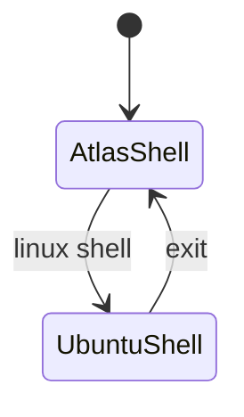

## Behavior

When Ubuntu shell mode is active:

```text
root@atlas:~#
```

ordinary commands are sent to the Ubuntu guest through the finite guest-command path. Commands recognized as supported interactive applications are routed to the interactive PTY path.

When the user runs:

```text
exit
```

Atlas leaves Ubuntu shell mode and returns to:

```text
atlas@cyberdeck:~$
```

without unnecessarily stopping the Linux runtime.

---

# 19. Guest Command Executor

The guest command executor bridges **finite** Atlas terminal commands to the running Ubuntu environment.

It is intentionally not the transport for full-screen interactive applications. Interactive PTY applications use the dedicated PTY subsystem described below.

Responsibilities include:

- command submission
- timeout selection
- streaming stdout
- streaming stderr
- command-completion detection
- exit-code capture
- package-command handling
- runtime-death detection
- recovery restrictions
- safety escalation

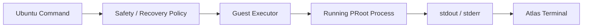

---

# 20. Streaming Execution

Guest commands execute asynchronously.

This prevents long-running Linux work from blocking the Android UI thread.

The terminal layer uses coroutine-based execution and streamed output so operations such as package installation can update the terminal while they run.

Architecturally:

```text
UI Thread
   │
   └── submit command
          │
          ▼
      ViewModel
          │
          ▼
   Coroutine / IO work
          │
          ▼
   Guest Executor
          │
          ▼
   streamed output
          │
          ▼
      UI state
```

---

# 21. Interactive PTY Terminal Architecture

Atlas provides a dedicated PTY path for validated full-screen Linux applications.

The PTY subsystem is separate from the finite guest-command executor so interactive applications can own a terminal session without weakening normal command timeout, package, recovery, or safety behavior.

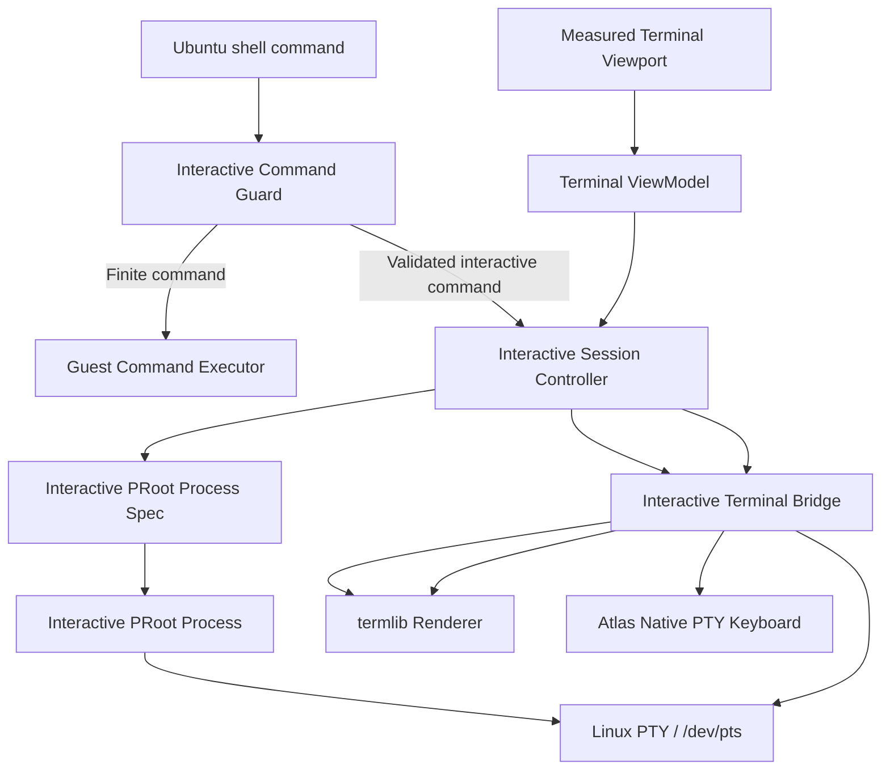

## Current validated applications

```text
nano
vim
```

The interactive command guard remains in place for terminal-oriented commands Atlas has not explicitly validated.

### Architectural rule

> **Do not silently present non-PTY execution as a fully interactive terminal.**

Supported interactive commands are routed into the PTY subsystem. Unsupported interactive commands remain guarded rather than being falsely represented as working.

---

# 22. Persistent Interactive Session Ownership

Interactive terminal sessions are owned at application-process scope rather than by a screen-scoped ViewModel.

Conceptually:

```text
TerminalScreen
    │ attach / detach
    ▼
TerminalViewModel
    │
    ▼
LinuxInteractiveTerminalSessionController
    │
    ├── active interactive process
    ├── terminal bridge
    ├── emulator state
    ├── input routing
    ├── resize coordination
    └── lifecycle monitor
```

This allows an active PTY application to survive ordinary UI recreation.

Device-validated behavior includes:

- Terminal → Dashboard → Terminal;
- Android Home → return to Atlas;
- preservation of unsaved Nano state;
- Vim session persistence;
- natural application exit back to Ubuntu shell mode.

---

# 23. Interactive Terminal Bridge

The interactive terminal bridge coordinates bytes between the Linux PTY and the Android terminal renderer.

Responsibilities include:

- input delivery to the interactive process;
- PTY output delivery to the terminal emulator;
- PTY-active state;
- terminal-emulator coordination;
- live resize;
- safe teardown.

The bridge does not replace the Linux runtime controller or guest-command executor. It is a specialized transport for a running interactive PTY session.

---

# 24. Live PTY Resize

Interactive terminal geometry is derived from the actual rendered terminal viewport.

Resize flow:

```text
Terminal viewport measurement
    ↓
TerminalViewModel debounce
    ↓
Interactive Session Controller
    ↓
Interactive Terminal Bridge
    ↓
Linux PTY stty rows / cols
    ↓
termlib emulator resize
```

The guest PTY is resized before the renderer is committed to the new geometry. Resize behavior is fail-closed: Atlas does not knowingly leave the guest and renderer on contradictory geometry when the PTY resize fails.

---

# 25. Atlas Native PTY Keyboard

Atlas provides an on-screen keyboard specifically for interactive PTY applications.

Current capabilities include:

- letters and numbers;
- Shift;
- Space;
- Enter;
- Backspace;
- Ctrl;
- Esc;
- Tab;
- arrow keys;
- dedicated `Ctrl+C`, `Ctrl+O`, and `Ctrl+X` actions;
- one-shot Ctrl combinations;
- `SYM` / `ABC` punctuation layer.

The native Android soft keyboard is suppressed while the Atlas PTY keyboard is active.

termlib remains configured to accept physical / Bluetooth keyboard input, but that input path was not part of the current physical-device regression pass.

---

# 26. Interactive Session Lifecycle Monitoring

Interactive session ownership includes a lightweight process-level lifecycle monitor.

The monitor observes whether the interactive bridge remains active and clears application-level interactive-session state after the PTY command naturally completes.

This prevents a completed interactive application from being represented indefinitely as an active PTY session.

Natural Nano and Vim exit paths were validated on-device.

---

# 27. Android DNS Synchronization

The Ubuntu guest uses Android's active DNS environment.

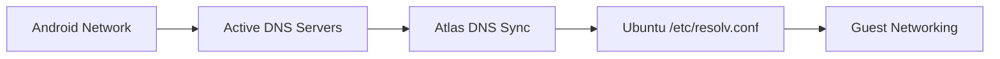

This avoids hard-coding public resolvers and allows the guest to follow the device's current network configuration.

---

# 28. Package Management Architecture

Ubuntu package management uses standard Debian tools:

```text
apt
apt-get
dpkg
```

Atlas adds policy around package mutation.

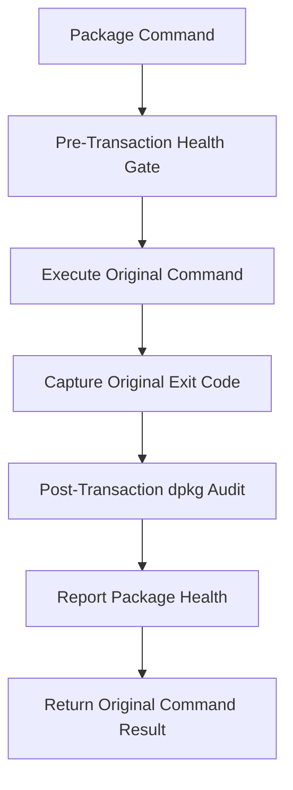

## Design principles

- Atlas does not silently append confirmation flags
- mutating package commands require explicit user intent
- package health is checked before mutation
- package state is audited afterward
- the original command exit status remains authoritative
- a clean audit does not convert a failed repair command into success

---

# 29. Runtime Safety Architecture

Atlas includes a fail-closed safety subsystem around the Linux runtime.

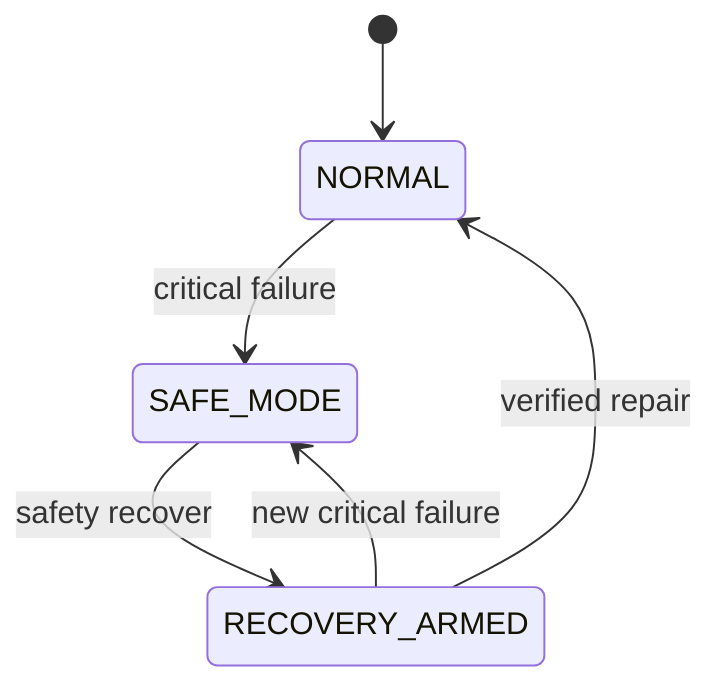

Current states:

```text
NORMAL
SAFE_MODE
RECOVERY_ARMED
```

---

# 30. Safety State Machine

Pure safety transition rules are separated from side effects.

Conceptually:

```text
LinuxRuntimeSafetyStateMachine
        │
        ├── canStartRuntime()
        ├── trip()
        ├── armRecovery()
        ├── reset()
        ├── failClosed()
        └── withCleanupResult()
```

The state machine does **not** need to know about:

- Android
- PRoot
- filesystem paths
- process termination
- disk persistence
- coroutines

This allows critical safety policy to be tested as ordinary JVM logic.

---

# 31. Runtime Circuit Breaker

The circuit breaker owns safety side effects and persistence.

Responsibilities include:

- loading persisted safety state
- publishing reactive safety state
- tripping Safe Mode
- stopping the Linux runtime
- cleaning transient state
- preserving persistent data
- arming controlled recovery
- clearing state after verified repair

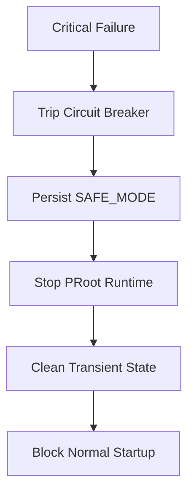

---

# 32. Fail-Closed Behavior

If Atlas cannot reliably determine whether the runtime is safe, the architecture prefers blocking runtime access over assuming everything is normal.

Examples include:

- corrupted safety-state record
- runtime integrity failure
- package integrity failure
- filesystem failure
- unexpected runtime-process loss

### Principle

> **Unknown integrity must not silently become NORMAL.**

---

# 33. Recovery Architecture

Recovery is intentionally narrower than normal runtime operation.

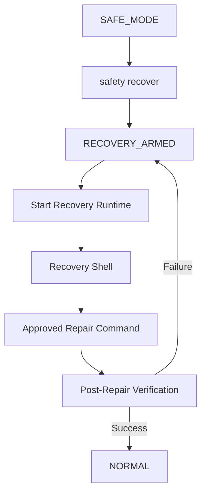

During recovery:

- the runtime may start
- Linux shell access may be available
- only approved repair and diagnostic operations are permitted
- audit-only commands do not clear recovery
- failed repair commands do not clear recovery
- recovery clears only after a verified successful repair

---

# 34. Recovery Policy

The recovery policy separates:

```text
allowed diagnostics
repair operations
audit-only operations
disallowed commands
```

Examples of repair operations include:

```text
dpkg --configure -a
dpkg --configure --pending
apt --fix-broken install -y
apt-get -f install -y
```

An audit such as:

```text
dpkg --audit
```

may help inspect package state, but is not itself sufficient to prove that a failed repair succeeded.

---

# 35. Reactive Safety State

Runtime safety is observable.

```text
MutableStateFlow
      ↓
StateFlow
      ↓
Terminal
Linux Manager
App-Wide Banner
Diagnostics
Status
Neofetch
```

This prevents safety presentation from depending on manual UI refresh logic.

---

# 36. Safety-Aware UI

Safety state is surfaced across the application.

| State | Visual Identity |
|---|---|
| NORMAL / Atlas | Standard Atlas theme |
| Ubuntu | Black + Matrix green |
| SAFE_MODE | Black + yellow |
| RECOVERY_ARMED | Black + amber |

Safety identity takes precedence over ordinary shell identity.

The UI must not make a blocked runtime appear available.

---

# 37. Diagnostics Architecture

Atlas diagnostics consolidate information from multiple subsystems.

Current diagnostic areas include:

```text
Atlas version
filesystem
runtime storage
command registry
handler registry
plugin registry
Linux runtime
runtime assets
runtime ABI
runtime safety
runtime access
safety reason
cleanup result
device profile
overall health
```

Commands exposing runtime state include:

```text
diagnostics
status
neofetch
version
```

Diagnostics should reflect authoritative runtime state rather than reconstructing state independently.

---

# 38. Runtime Data Ownership

Atlas distinguishes between persistent and transient runtime data.

## Persistent

Examples:

```text
Ubuntu RootFS
user files
package database
package metadata
.l2s state
installation state
safety record
```

## Transient

Examples may include:

```text
temporary process state
ephemeral runtime markers
disposable launcher state
```

### Rule

Recovery cleanup should target **transient state only** unless the user explicitly requests a destructive action.

---

# 39. Process State vs Repository State

A central design lesson in Atlas is that:

> **Saved application state does not prove a native process is alive.**

The runtime system therefore reconciles:

```text
repository state
backend state
actual process state
session state
```

instead of treating any one signal as sufficient.

---

# 40. SOLID Principles

Atlas is not structured around SOLID terminology for appearance alone; the principles are used where they improve maintainability.

## Single Responsibility

Examples:

```text
Runtime Controller      → runtime orchestration
Runtime Backend         → runtime implementation
Guest Executor          → finite guest command execution
PTY Session Controller  → persistent interactive session ownership
PTY Bridge              → PTY / renderer coordination
Safety State Machine    → pure safety transitions
Circuit Breaker         → persistence + safety side effects
Repository              → installation/runtime data model
UI                      → rendering and user intent
```

## Open/Closed

Command registries, handler registries, plugins, and backend abstractions allow extension without rewriting central application logic.

## Liskov Substitution

Runtime consumers should rely on backend contracts rather than PRoot-specific assumptions where abstraction exists.

## Interface Segregation

Components are kept narrow rather than exposing one oversized runtime API to every layer.

## Dependency Inversion

Higher-level runtime control depends on backend abstractions rather than directly coupling application logic to native PRoot process implementation.

---

# 41. Testing Strategy

Atlas uses multiple levels of validation.

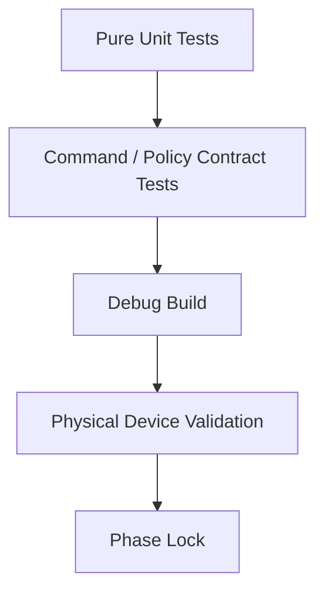

## Unit tests

Used for logic that does not require Android.

Examples:

- safety state transitions
- package policy
- command behavior
- parsing
- registries

## Contract tests

Used when direct JVM execution would incorrectly require Android/runtime initialization.

Examples:

- preserving `linux shell`
- preserving Safe Mode messages
- preserving Recovery Mode command branches

## Device validation

Required for behaviors involving:

- native ARM64 binaries
- PRoot
- Ubuntu RootFS
- Android filesystem behavior
- package installation
- networking
- process lifecycle
- PTY allocation and `/dev/pts`
- Nano and Vim workflows
- interactive-session persistence
- live PTY resize
- Atlas-native PTY keyboard input
- natural interactive-session exit
- Compose/runtime integration

---

# 42. Build Validation

Standard local validation:

```bash
./gradlew testDebugUnitTest
./gradlew assembleDebug
```

Physical-device installation:

```bash
./gradlew installDebug
```

A successful compilation alone is not considered sufficient validation for runtime-critical phases.

---

# 43. Continuous Integration

Atlas uses Git-based source control and automated CI validation.

Current engineering flow:

```text
Design
  ↓
Implement
  ↓
Build
  ↓
Test
  ↓
Device Validation
  ↓
Lock
  ↓
Commit
  ↓
Push
  ↓
CI
```

CI is intended to catch regressions that can be detected in a deterministic build/test environment, while native Android runtime behavior continues to require device validation where appropriate.

---

# 44. Source Control Strategy

Atlas is maintained with Git and mirrored across:

```text
GitHub
GitLab
```

The project uses incremental engineering checkpoints so architecture changes can be isolated and reviewed.

The repository should remain buildable at locked checkpoints.

---

# 45. Package Organization

The current Android namespace remains:

```text
com.noahrose.pocketlab
```

while the product branding is Atlas Cyberdeck.

Major package areas include:

```text
com.noahrose.pocketlab
├── feature
│   ├── filesystem
│   ├── linux
│   │   └── runtime
│   │       ├── command
│   │       ├── process
│   │       ├── platform
│   │       └── safety
│   ├── system
│   └── terminal
└── ui
```

The legacy namespace is intentionally preserved until a dedicated package-migration phase is justified.

---

# 46. Architecture Decision Records

Significant architectural decisions should be documented under:

```text
docs/adr/
```

ADRs are appropriate when a decision:

- changes a major subsystem boundary
- introduces a long-lived dependency
- changes runtime safety policy
- changes persistence behavior
- changes Linux execution strategy
- creates compatibility obligations
- affects future platform support

---

# 47. Engineering Documentation

Deep implementation notes should live under:

```text
docs/engineering/
```

The README should explain **what Atlas is**.

The roadmap should explain **where Atlas is going**.

This architecture document should explain **how the major systems fit together**.

Engineering documents should explain **how specific subsystems work internally**.

---

# 48. Security Design Principles

Atlas runtime security is based on practical containment and explicit boundaries rather than claiming Android-level isolation that PRoot does not provide.

Core principles:

- no Android root requirement
- fail closed on uncertain runtime integrity
- preserve user data during recoverable failures
- restrict recovery operations
- keep destructive actions explicit
- surface safety state visibly
- do not silently bypass runtime gates
- do not equate guest UID 0 with Android root
- do not make unsupported claims about system-level isolation

---

# 49. Future Architectural Directions

Planned architecture work may include:

```text
SSH subsystem
secure key storage
Git workflows
workspace snapshots
backup / restore
expanded plugin APIs
broader interactive application coverage
networking tools
tablet layouts
Chromebook support
desktop edition
```

Each major subsystem should integrate through existing architectural boundaries rather than becoming a special-case shortcut.

---

# 50. Desktop and Multi-Device Direction

The Android application is the current primary platform.

Long-term architecture should avoid unnecessary assumptions that prevent:

- tablet layouts
- Chromebook workflows
- desktop clients
- shared project formats
- common command architecture
- portable workspace metadata

Not every Android implementation detail will be portable, but platform-independent domain logic should remain separable where practical.

---

# 51. Dedicated Hardware Direction

Dedicated Atlas hardware remains exploratory.

If pursued, the software architecture should allow the same product concepts to survive:

```text
Atlas shell
Linux workspace
runtime safety
diagnostics
plugins
remote workflows
workspace portability
```

rather than creating an unrelated second platform.

---

# 52. Architectural Non-Goals

Atlas does not currently claim to be:

- a replacement for Android itself
- a rooted Android distribution
- a full virtual machine
- a hardware hypervisor
- a complete desktop Linux environment
- a replacement for a dedicated desktop terminal emulator
- an anti-forensics platform

The architecture is designed around a **rootless Linux userspace managed by a native Android application**.

---

# 53. Architecture Principles Summary

```text
Atlas owns application behavior.
Ubuntu owns Linux userspace behavior.

The controller owns runtime orchestration.
The backend owns runtime implementation.
The executor owns finite guest command execution.

The PTY session controller owns persistent interactive sessions.
The PTY bridge owns interactive PTY / renderer coordination.

The state machine owns safety rules.
The circuit breaker owns safety side effects.

The UI renders authoritative state.
The UI does not invent runtime state.

Persistent data survives recoverable failure.
Transient data may be cleaned safely.

Unknown integrity fails closed.
Verified recovery returns to normal.
```

---

<div align="center">

## Atlas Labs

### **Build the platform. Prove the runtime. Earn the trust.**

<br>

> *"Maybe not breaking free from the Matrix—but we are writing our own code instead of living inside someone else's. That is a pretty good way to spend our time."*

<br>

**Atlas Cyberdeck — v0.13.0-alpha**

### **Your Cyberdeck. Anywhere.**

</div>
