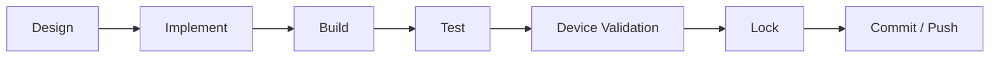
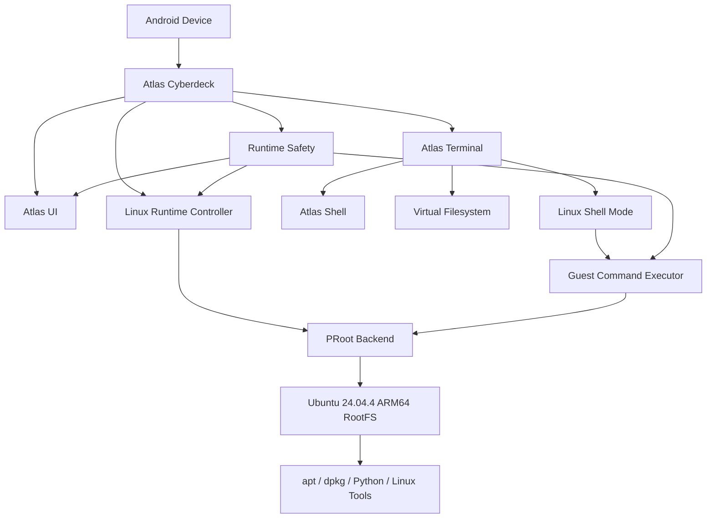

<div align="center">

# Atlas Cyberdeck — Development Roadmap

### **Your Cyberdeck. Anywhere.**

**Current release:** `v0.13.0-alpha`  
**Current public phase:** Product Readiness  
**Engineering source-of-truth endpoint:** `F3P-H5B`

</div>

---

## Product North Star

> **A serious Linux workspace should be able to travel in your pocket without requiring you to surrender control of your Android device.**

Atlas Cyberdeck is being built as a portable Linux workspace and extensible cyberdeck platform for Android, with an emphasis on:

1. **runtime reliability**
2. **safe failure behavior**
3. **real Linux capability**
4. **portable developer workflows**
5. **extensibility**
6. **professional product quality**

---

## How Atlas Development Works

Atlas development is organized into **engineering phases**.

A phase is not considered complete simply because code exists. Runtime-critical work must build cleanly, pass automated validation where practical, survive physical-device testing, and be explicitly locked before development continues.



---

## Status Legend

| Status | Meaning |
|---|---|
| ✅ **LOCKED** | Implemented, validated, and accepted |
| 🟢 **ACTIVE** | Current engineering work |
| 🟡 **PLANNED** | Defined future work |
| 🔵 **EXPLORATORY** | Long-term research or product direction |
| ⏸️ **DEFERRED** | Intentionally postponed |

---

# Current Position

| Product Area | Status |
|---|:---:|
| Android Application Foundation | ✅ |
| Atlas Terminal | ✅ |
| Persistent Virtual Filesystem | ✅ |
| Command Architecture | ✅ |
| Plugin Foundation | ✅ |
| Ubuntu ARM64 Runtime | ✅ |
| Persistent Linux Shell | ✅ |
| Package Management | ✅ |
| Runtime Safety | ✅ |
| Regression Hardening | ✅ |
| Documentation & Product Readiness | 🟢 |
| Pre-Launch Preparation | 🟡 |
| Atlas Cyberdeck 1.0 | 🟡 |

Atlas is currently in the **v0.13.0-alpha** development line.

The Linux runtime program has progressed from device capability detection to a functioning Ubuntu ARM64 environment with PRoot execution, package management, networking, persistent shell access, runtime safety, controlled recovery, and regression protection.

---

# Public Product Roadmap

## Phase 1 — Platform Foundation

**Status:** ✅ LOCKED

This phase established Atlas Cyberdeck as a stable native Android application.

### Delivered

- Kotlin Android foundation
- Jetpack Compose
- Material 3
- navigation architecture
- boot experience
- dashboard
- terminal screen
- Linux Manager
- files screen
- settings
- ViewModel-driven state
- StateFlow integration
- cyberdeck-inspired visual identity
- device capability awareness

### Result

Atlas became a functioning Android platform rather than a collection of disconnected screens.

---

## Phase 2 — Atlas Shell & Virtual Filesystem

**Status:** ✅ LOCKED

This phase established the independent Atlas shell environment and persistent virtual filesystem.

### Atlas shell

- command registry
- command dispatcher
- modular command handlers
- command history
- history recall
- aliases
- environment variables
- wildcard expansion
- hardware keyboard completion
- command pipelines
- registry-driven help
- Atlas `.ash` scripts
- plugin framework foundation
- built-in diagnostics

### Virtual filesystem

- persistent filesystem state
- working-directory tracking
- relative paths
- file creation
- file reading and writing
- copying
- moving and renaming
- deletion
- directory creation and removal
- filesystem search
- tree visualization

### Architectural rule

> **The Atlas shell is not Ubuntu.**

Atlas maintains its own command environment, filesystem, state, scripting model, diagnostics, and application-level controls independently of the Linux guest.

---

## Phase 3 — Ubuntu Linux Runtime

**Status:** ✅ LOCKED

This phase moved Atlas from a Linux-manager concept to a functioning rootless Ubuntu environment on Android.

### Delivered

- Linux feature gating
- device capability detection
- persistent Linux installation state
- runtime controller
- runtime backend abstraction
- native PRoot launcher
- ARM64 ABI detection
- native runtime packaging
- runtime path management
- runtime storage preparation
- Ubuntu ARM64 root filesystem
- RootFS staging and provisioning
- guest handshake
- real command execution bridge
- persistent Ubuntu shell
- runtime diagnostics
- runtime provenance checks
- rootless Android execution

### Current guest

```text
Distribution : Ubuntu 24.04.4 LTS
Architecture : ARM64 / AArch64
Runtime      : PRoot
Guest UID    : 0
Home         : /root
Android Root : Not required
```

### Example

```console
atlas@cyberdeck:~$ linux start
Linux runtime started.

atlas@cyberdeck:~$ linux shell
Ubuntu shell mode enabled.
Type 'exit' to return to Atlas.

root@atlas:~#
```

---

## Phase 4 — Linux Networking, Filesystem Compatibility & Package Management

**Status:** ✅ LOCKED

This phase made the Ubuntu guest useful for real development workflows.

### Delivered

- Android DNS discovery
- guest `/etc/resolv.conf` synchronization
- functional Linux network resolution
- functional `apt update`
- PRoot link-to-symlink compatibility
- dedicated `.l2s` state
- corrected guest `/tmp`
- dedicated host-side PRoot temporary storage
- `/dev`, `/proc`, and `/sys` bindings
- streaming guest command output
- `apt`
- `apt-get`
- `dpkg`
- package preflight health checks
- post-transaction package audits
- explicit noninteractive package policy
- preservation of original command exit status
- package-integrity failure detection

### Example

```console
root@atlas:~# apt install -y python3
...
Atlas package health: CLEAN

root@atlas:~# python3 --version
Python 3.12.3
```

---

## Phase 5 — Runtime Safety & Recovery

**Status:** ✅ LOCKED

Atlas treats Linux runtime integrity as a first-class system concern.

### Safety states

| State | Runtime Access | Purpose |
|---|---|---|
| 🟢 **NORMAL** | Enabled | Standard Linux operation |
| 🟡 **SAFE_MODE** | Blocked | Fail closed after a serious runtime, filesystem, package, or integrity failure |
| 🟠 **RECOVERY_ARMED** | Recovery only | Permit controlled repair while restricting guest commands |

### Delivered

- fail-closed runtime circuit breaker
- persistent safety state
- runtime shutdown after critical failure
- transient-state cleanup
- preservation of RootFS and user data
- controlled recovery arming
- verified repair requirement
- reactive safety state
- terminal safety identity
- app-wide safety banner
- safety-aware Linux controls
- runtime access reporting
- safety reason reporting
- safety cleanup reporting
- `diagnostics` safety integration
- `status` safety integration
- `neofetch` safety integration
- developer force-reset escape hatch

### Safety commands

```text
safety status
safety recover
safety trip-test
safety reset --force
```

---

## Phase 6 — Regression Hardening

**Status:** ✅ LOCKED THROUGH `H5B`

This phase protects critical runtime behavior from accidental regression.

### Delivered

- Linux command contract tests
- protection for `linux shell`
- Safe Mode command-contract coverage
- Recovery Mode command-contract coverage
- package policy validation
- recovery behavior validation
- runtime access validation
- pure safety state-machine tests

### Direct JVM safety coverage

```text
NORMAL         → runtime allowed
SAFE_MODE      → runtime blocked
RECOVERY_ARMED → runtime allowed for recovery

trip           → SAFE_MODE
armRecovery    → RECOVERY_ARMED
reset          → NORMAL
corrupt state  → fail closed
```

### Result

Critical safety policy can be tested independently of Android, PRoot, persistence, and filesystem side effects.

---

## Phase 7 — Documentation & Product Readiness

**Status:** 🟢 ACTIVE

The codebase advanced faster than the public-facing documentation during the Linux runtime program.

This phase brings the repository, engineering documentation, visual identity, and product story back into alignment.

### In progress

- README redesign
- roadmap synchronization
- architecture synchronization
- changelog reconstruction
- command reference updates
- Linux runtime documentation
- runtime-safety documentation
- recovery documentation
- testing documentation
- updated screenshots
- professional architecture diagrams
- consistent Atlas Labs visual identity
- repository presentation cleanup
- release-readiness documentation

### Product-readiness goal

A visitor should be able to understand within seconds that Atlas is:

> **A rootless Ubuntu Linux workspace and extensible cyberdeck platform for Android.**

---

## Phase 8 — Pre-Launch & Kickstarter Preparation

**Status:** 🟡 PLANNED

Pre-launch preparation begins before Atlas 1.0 and remains separate from the actual commercial launch.

### Planned work

- Atlas Labs landing page
- product positioning
- mailing-list capture
- launch screenshots
- professional terminal demos
- 30–60 second real-device demo video
- campaign story
- campaign budget
- reward structure
- founder story
- FAQ
- risks and challenges section
- campaign visual assets
- pre-launch audience building
- launch-day communications
- Kickstarter feasibility validation

### Campaign principle

A crowdfunding campaign should promise only clearly defined Atlas 1.0 deliverables that can be realistically completed and supported.

---

## Phase 9 — Remote Development & Administration

**Status:** 🟡 PLANNED

This phase expands Atlas from a local Linux environment into a portable remote-development and administration workstation.

### Planned areas

- SSH client
- saved SSH profiles
- secure key handling
- known-host verification
- session management
- connection diagnostics
- remote command workflows
- remote file transfer

Security-sensitive functionality will be designed around explicit user control and safe defaults.

---

## Phase 10 — Git & Developer Workflows

**Status:** 🟡 PLANNED

### Planned areas

- Git repository operations
- clone
- status
- branch workflows
- commit workflows
- pull / push workflows
- repository browser
- developer project workspaces
- Linux guest integration where appropriate

---

## Phase 11 — Workspace Resilience

**Status:** 🟡 PLANNED

Atlas already protects Linux runtime integrity. This phase expands resilience into user-controlled workspace protection.

### Planned areas

- Linux workspace snapshots
- restore points
- export / import workflows
- backup validation
- storage-health reporting
- controlled workspace recovery

### Design rule

No destructive feature should silently erase the user's primary Atlas or Ubuntu environment.

---

## Phase 12 — Platform Extensibility

**Status:** 🟡 PLANNED

### Planned areas

- expanded plugin architecture
- additional Atlas scripting capabilities
- extension APIs
- modular tools
- expanded networking utilities
- configurable cyberdeck modules

The long-term goal is for Atlas to become a platform rather than a fixed collection of screens and commands.

---

## Phase 13 — Atlas Cyberdeck 1.0

**Status:** 🟡 PLANNED

Version 1.0 represents a **product-quality threshold**, not simply a version-number change.

### 1.0 focus

- stable Linux runtime
- stable install / remove lifecycle
- runtime failure recovery
- polished terminal experience
- reliable networking
- verified package workflows
- broad regression coverage
- accessibility review
- device compatibility matrix
- onboarding
- user documentation
- privacy review
- security review
- release signing
- distribution readiness
- performance profiling
- battery and storage behavior
- support and issue workflow

### Release principle

> **Atlas 1.0 should be something we are comfortable asking real users to trust with their mobile Linux workspace.**

---

## Phase 14 — Commercial & Community Launch

**Status:** 🟡 PLANNED

Atlas Cyberdeck is intended to remain technically credible first and commercially viable second.

### Planned launch work

- public Atlas Labs website
- product landing page
- public documentation portal
- professional demo video
- real-device demonstrations
- launch screenshots
- early-access community
- pricing validation
- Free / Pro feature boundaries
- education opportunities
- team-use research
- public distribution
- launch communications
- post-launch feedback loop

### Product principle

Core runtime safety should remain part of the platform foundation rather than becoming a paywalled protection feature.

---

## Phase 15 — Multi-Device Expansion

**Status:** 🔵 EXPLORATORY

### Future targets

- Android tablets
- Chromebooks
- desktop edition
- desktop/mobile workflow continuity
- larger-screen terminal layouts
- keyboard-first workflows

---

## Phase 16 — Dedicated Cyberdeck Hardware

**Status:** 🔵 EXPLORATORY

A long-term direction for Atlas Labs is dedicated cyberdeck hardware.

### Research areas

- compact ARM compute platforms
- integrated keyboard
- portable display
- modular connectivity
- field-service workflows
- hardware-backed security
- Atlas-first operating experience

This phase remains intentionally exploratory until the Android software platform reaches sufficient maturity.

---

# Engineering Completion Record

The public phases above are intentionally easy to read.

The detailed internal engineering track remains preserved below for developers, contributors, future maintainers, and historical traceability.

<details>
<summary><strong>Expand complete Linux runtime engineering track</strong></summary>

<br>

## F3A–F3M — Runtime Architecture

**Status:** ✅ LOCKED

- F3A — Linux feature gate enforcement
- F3B — capability UI
- F3C — capability synchronization
- F3D — persistent installation
- F3E — runtime session state
- F3F — status integration
- F3G — runtime controls
- F3H — terminal Linux controls
- F3I — diagnostics / neofetch
- F3J — status-model consolidation
- F3K — controller consolidation
- F3L — backend abstraction
- F3M-A — result model
- F3M-B — session model
- F3M-C — backend-owned session

## F3N — Native Runtime

**Status:** ✅ LOCKED

- F3N-A — process launcher
- F3N-B — runtime paths
- F3N-C — storage preparation
- F3N-D — filesystem diagnostics
- F3N-E — asset readiness
- F3N-F — binary provisioning
- F3N-G — ABI detection
- F3N-H — architecture descriptor
- F3N-I — native diagnostics
- F3N-J — provenance
- F3N-L — native runtime packaged in APK
- F3N-M — native resolver
- F3N-N — runtime integrity

## F3O — Ubuntu RootFS

**Status:** ✅ LOCKED

- F3O-A — Ubuntu ARM64 source
- F3O-B — provenance diagnostics
- F3O-C — archive staging
- F3O-D — staging diagnostics
- RootFS provisioning

## F3P — Real Linux Execution

**Status:** ✅ LOCKED THROUGH H5B

- F3P-A — launch specification
- F3P-B — real PRoot backend
- F3P-C — launch diagnostics
- F3P-D — guest handshake
- F3P-E — real command bridge
- F3P-F — persistent shell mode
- F3P-G1 — Linux prompt
- G2 — visual shell identity
- G3 — shell polish
- G4 — PTY guard

## H1 — Networking

**Status:** ✅ LOCKED

- H1A — DNS / apt
- H1B — nonblocking execution / ANR protection
- H1C — Android DNS synchronization

## H2 — Package Filesystem Compatibility

**Status:** ✅ LOCKED

- H2A — link-to-symlink flags
- H2B — `PROOT_L2S_DIR`
- H2C — streaming
- H2 — package installation

## H3 — Package Hardening

**Status:** ✅ LOCKED

- H3A — package command hardening
- H3B — transaction post-audit
- H3C — pre-transaction health gate

## H4 — Runtime Safety

**Status:** ✅ LOCKED

- H4A — runtime circuit breaker & recovery
- H4B — visual safety identity
- H4C — reactive safety state
- H4D — app-wide safety identity
- H4E — safety-aware Linux controls
- H4F — safety diagnostics
- H4G — safety state in status / neofetch
- H4G hotfix — persistent `linux shell` restoration

## H5 — Regression Hardening

**Status:** ✅ LOCKED THROUGH H5B

- H5A — Linux command contract tests
- H5B — safety state unit-testability

**Current engineering endpoint:** `F3P-H5B`

</details>

---

# Runtime Architecture Snapshot



---

# Deferred Concepts

## Burner Mode

**Status:** ⏸️ DEFERRED

Burner Mode is a future disposable-workspace concept.

The current design direction preserves:

- the Atlas application;
- the primary Atlas workspace;
- the primary Ubuntu installation.

Any future Burner implementation should operate only on explicitly disposable Burner-owned data.

It should not claim to erase Android, network-provider, cloud-provider, or external-system records.

---

# Roadmap Principles

Atlas Cyberdeck development follows several non-negotiable principles:

### 1. Build real capability

Features should solve real technical problems rather than exist only for presentation.

### 2. Preserve user trust

Runtime failures must not silently destroy user data or bypass safety controls.

### 3. Fail closed when integrity is uncertain

Unknown or corrupted safety state should not be treated as safe by default.

### 4. Keep Atlas and Ubuntu architecturally distinct

The Atlas shell remains an application platform. Ubuntu remains the Linux guest.

### 5. Test critical policy independently

Safety and command contracts should be unit-testable wherever practical.

### 6. Treat documentation as part of the product

Architecture, roadmap, security behavior, recovery behavior, and user-facing capability should stay synchronized with the codebase.

---

<div align="center">

## Atlas Labs

### **Build the platform. Prove the runtime. Earn the trust.**

<br>

> *"Maybe not breaking free from the Matrix—but we are writing our own code instead of living inside someone else's. That is a pretty good way to spend our time."*

<br>

**Atlas Cyberdeck — v0.13.0-alpha**

### **Your Cyberdeck. Anywhere.**

</div>
