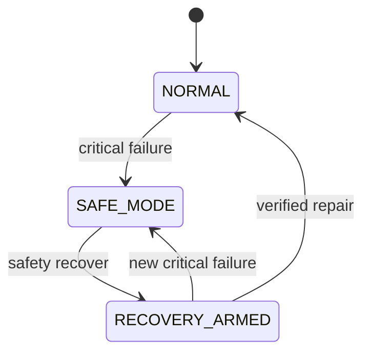

# ADR-008 — Runtime Safety Model

**Status:** Accepted  
**Product:** Atlas Cyberdeck  
**Current release:** v0.13.0-alpha

---

## Context

Atlas Cyberdeck manages a persistent Linux userspace with package databases, user data, runtime processes, filesystem-compatibility state, and guest command execution.

A serious runtime failure can leave application state and native process state out of sync.

Examples include:

- unexpected PRoot process loss;
- package database corruption;
- failed package transactions;
- runtime integrity failure;
- filesystem failure;
- corrupted persisted safety state.

Continuing normal runtime operation after an integrity failure could make damage worse or give the user a false impression that the environment is healthy.

A simple boolean such as `runtimeHealthy` would not provide enough control for safe recovery.

---

## Decision

Atlas Cyberdeck will use a **fail-closed, multi-state runtime safety model**.

Current safety states:

```text
NORMAL
SAFE_MODE
RECOVERY_ARMED
```

### NORMAL

Normal runtime access is allowed.

### SAFE_MODE

Normal runtime startup and Ubuntu shell entry are blocked.

### RECOVERY_ARMED

The runtime may start for controlled repair, but guest execution is restricted by recovery policy.

---

## State Model



---

## Pure State Machine

Safety transition policy is implemented separately from side effects.

Conceptual responsibilities:

```text
LinuxRuntimeSafetyStateMachine
├── canStartRuntime()
├── isRecoveryArmed()
├── trip()
├── withCleanupResult()
├── armRecovery()
├── reset()
└── failClosed()
```

The state machine does not require:

- Android;
- PRoot;
- filesystem paths;
- disk persistence;
- process termination;
- coroutines.

This keeps safety policy deterministic and unit-testable.

---

## Circuit Breaker

The `LinuxRuntimeCircuitBreaker` owns side effects and persistence.

Responsibilities include:

- persisting safety state;
- publishing reactive state;
- stopping the runtime after a trip;
- cleaning transient state;
- preserving persistent state;
- arming recovery;
- resetting after verified recovery;
- failing closed when the safety record cannot be trusted.

---

## Fail-Closed Rule

If Atlas cannot determine runtime safety reliably, the default is not `NORMAL`.

Preferred principle:

> **Unknown integrity fails closed.**

For example, an unreadable or corrupted safety record results in:

```text
SAFE_MODE
reason = RUNTIME_INTEGRITY_FAILURE
```

instead of silently resetting to normal.

---

## Safety Reasons

Current safety reasons include concepts such as:

```text
RUNTIME_PROCESS_LOST
RUNTIME_INTEGRITY_FAILURE
GUEST_HEALTH_FAILURE
PACKAGE_STATE_FAILURE
FILESYSTEM_FAILURE
MANUAL_TEST
```

The reason is diagnostic metadata, not a replacement for the safety mode.

---

## Startup Gate

Normal Linux startup must call the safety gate before backend launch.

Conceptually:

```text
Start Request
    ↓
canStartRuntime()
    ↓
NORMAL / RECOVERY_ARMED → allowed
SAFE_MODE                → blocked
```

Recovery Mode may permit runtime start, but the guest executor remains restricted.

---

## Reactive Safety State

Safety state is observable through `StateFlow`.

Consumers include:

- terminal;
- Linux Manager;
- app-wide safety banner;
- diagnostics;
- status;
- neofetch.

This prevents each UI surface from independently inferring safety state.

---

## Visual Priority

Safety identity takes precedence over shell identity.

Example:

```text
Ubuntu shell + SAFE_MODE
```

must appear as Safe Mode rather than ordinary Ubuntu green.

---

## Alternatives Considered

### Boolean healthy/unhealthy flag

Rejected because it cannot represent the difference between fully blocked runtime and controlled repair access.

### Automatically reset safety on app restart

Rejected because it would allow persistent integrity failures to disappear without repair.

### Continue runtime and only display warnings

Rejected because serious integrity failures require enforcement, not only notification.

---

## Consequences

### Positive

- Runtime access is explicitly controlled.
- Recovery has a distinct state.
- Safety survives app recreation.
- UI state remains synchronized.
- Safety policy can be unit-tested independently.
- Corrupted safety records fail closed.

### Tradeoffs

- More runtime states must be handled across the application.
- Recovery commands require policy maintenance.
- Incorrect safety transitions could unnecessarily block the user, so tests are important.
- The application must restore safety state early in startup.

---

## Validation

Validated behaviors include:

- Safe Mode blocks normal Linux start;
- Safe Mode blocks normal Ubuntu shell entry;
- Recovery Mode allows controlled runtime start;
- recovery restrictions remain enforced;
- verified repair clears the safety latch;
- failed repair leaves recovery armed;
- corrupted safety state fails closed;
- safety state is visible across the app.

---

## Related Components

- `LinuxRuntimeSafetyStateMachine`
- `LinuxRuntimeCircuitBreaker`
- `LinuxRuntimeSafetySnapshot`
- `LinuxRuntimeRecoveryPolicy`
- `LinuxRuntimeController`
- guest command executor
- `AtlasSafetyBanner`

---

## Related Decisions

- ADR-003 — Persistence Strategy
- ADR-004 — Testing Strategy
- ADR-006 — Linux Runtime Architecture
- ADR-009 — Controlled Recovery
