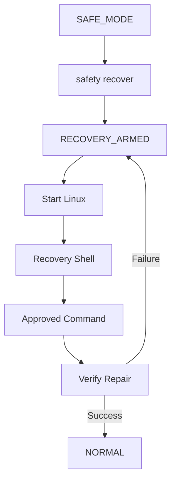

# ADR-009 — Controlled Recovery

**Status:** Accepted  
**Product:** Atlas Cyberdeck  
**Current release:** v0.13.0-alpha

---

## Context

When Atlas enters Safe Mode, completely blocking Linux protects the environment but does not provide a way to repair package or runtime state.

Allowing unrestricted Linux access during recovery would defeat the purpose of Safe Mode.

The system therefore needs a middle state that:

- permits the runtime to start;
- allows diagnostic and repair commands;
- blocks unrelated guest activity;
- preserves user data;
- verifies recovery before returning to normal operation.

Package-management behavior introduces an additional challenge.

A repair command can fail while a later audit reports no pending package configuration.

Therefore, a clean audit by itself is not enough to prove that recovery succeeded.

---

## Decision

Atlas Cyberdeck will use a distinct **controlled recovery mode** represented internally by:

```text
RECOVERY_ARMED
```

User-facing name:

```text
Recovery Mode
```

Recovery Mode allows the Linux runtime to start under command restrictions.

---

## Recovery Flow



---

## Allowed Recovery Categories

Recovery policy distinguishes:

```text
approved diagnostics
approved repair operations
audit-only operations
disallowed commands
```

Examples of repair operations include:

```text
dpkg --configure -a
dpkg --configure --pending
apt --fix-broken install -y
apt --fix-broken install --assume-yes
apt-get -f install -y
apt-get --fix-broken install -y
apt-get --fix-broken install --assume-yes
```

Examples of safe diagnostics may include:

```text
pwd
whoami
id
uname
cat /etc/os-release
dpkg --audit
```

The exact policy may evolve, but recovery remains allowlist-driven.

---

## Recovery Verification

Recovery clears only when all required conditions are satisfied.

For package repair:

1. the command must be an approved repair operation;
2. the command exit code must be `0`;
3. post-command package health must be verified as clean.

Conceptually:

```text
approved repair
    AND
exitCode == 0
    AND
package health == CLEAN
    ↓
clear recovery
```

---

## Audit-Only Rule

A command such as:

```text
dpkg --audit
```

may report useful state but does not itself prove that a repair occurred.

Therefore:

```text
audit success ≠ verified recovery
```

---

## Failed Repair Rule

A failed repair command remains failed even if a later audit reports clean state.

The original repair exit code is authoritative.

This prevents false-positive recovery clearing.

---

## Cleanup Policy

When the circuit breaker trips, Atlas may clean transient runtime state.

It must preserve:

- Ubuntu RootFS;
- user files;
- package database;
- package metadata;
- `.l2s` state;
- Atlas virtual filesystem;
- primary workspace data.

Recovery is designed to repair the persistent environment, not replace it automatically.

---

## Developer Escape Hatch

A force-reset command may exist for development and emergency testing:

```text
safety reset --force
```

This is not equivalent to verified recovery.

Documentation should make the distinction clear.

---

## Alternatives Considered

### Automatically reinstall Ubuntu

Rejected because it would destroy user state and package history.

### Allow unrestricted Linux access in Safe Mode

Rejected because the runtime would no longer be meaningfully protected.

### Clear recovery after any successful diagnostic command

Rejected because diagnostic success does not prove that the underlying integrity problem was repaired.

### Clear recovery when `dpkg --audit` is clean

Rejected because a failed repair can still be followed by a clean audit.

---

## Consequences

### Positive

- Users can repair rather than reinstall.
- Recovery remains constrained.
- Package repair success is verified explicitly.
- User data is preserved.
- Safety cannot be cleared by a diagnostic-only command.

### Tradeoffs

- Recovery allowlists require maintenance.
- Some legitimate repair operations may need to be added over time.
- Users may need clearer guidance when an unrecognized repair command is blocked.
- Recovery logic depends on accurate exit-code capture and package-health reporting.

---

## Validation

The recovery design has been validated through:

- manual safety trips;
- Safe Mode startup blocking;
- `safety recover`;
- Recovery Mode runtime startup;
- restricted guest commands;
- successful `dpkg --configure -a`;
- package-health verification;
- failed repair remaining armed;
- `dpkg --audit` not clearing recovery by itself;
- verified return to `NORMAL`.

---

## Related Components

- `LinuxRuntimeRecoveryPolicy`
- `LinuxRuntimeCircuitBreaker`
- guest command executor
- package command wrapper
- Linux shell mode
- runtime safety UI

---

## Related Decisions

- ADR-003 — Persistence Strategy
- ADR-008 — Runtime Safety Model
- ADR-010 — Atlas Shell vs Ubuntu Separation
