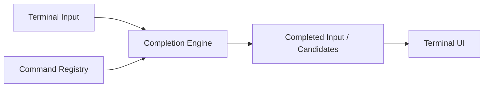

# Atlas Cyberdeck — Command Completion

**Document type:** Engineering  
**Status:** Current  
**Release baseline:** `v0.13.0-alpha`

---

## Purpose

This document describes the Atlas shell command-completion system.

Command completion is part of the Atlas shell architecture and operates independently of the Ubuntu guest.

Its purpose is to make the terminal faster to use with hardware keyboards while keeping completion behavior synchronized with the command registry.

---

## Design Goals

Command completion should be:

- registry-driven;
- predictable;
- non-destructive;
- fast;
- aware of partial command input;
- independent of Ubuntu runtime state;
- consistent with the commands exposed by `help`.

---

## Architectural Position



The completion engine should not maintain a second hard-coded command list.

The `CommandRegistry` is the authoritative source for registered Atlas command names.

---

## Command Registry Integration

Completion consumes the same command metadata used by:

- help;
- command discovery;
- command dispatch;
- diagnostics.

This prevents drift such as:

```text
command works but does not complete
```

or:

```text
completion suggests command that no longer exists
```

---

## Completion Trigger

The primary interaction is hardware keyboard Tab completion.

Conceptually:

```text
current input
    ↓
extract current token
    ↓
query completion candidates
    ↓
0 / 1 / many matches
```

---

## Match Behavior

### No matches

Leave the current input unchanged.

### One match

Complete the token.

Example:

```text
diag<Tab>
```

becomes:

```text
diagnostics
```

### Multiple matches

Preserve the common prefix where practical and surface or cycle candidates according to the current terminal UI behavior.

The completion engine should never silently execute the command.

---

## Command-Name Completion

For the first token, candidates come from the registered Atlas command set.

Examples may include:

```text
diagnostics
help
history
linux
neofetch
plugins
safety
status
version
```

---

## Path Completion

Where supported, path-aware completion should use the Atlas virtual filesystem when the active environment is the Atlas shell.

Examples:

```text
cat doc<Tab>
cd Proj<Tab>
runscript demo<Tab>
```

The Atlas VFS—not the Ubuntu RootFS—is authoritative in Atlas shell mode.

---

## Ubuntu Shell Behavior

The Atlas command-completion engine is not automatically reused as a fake Linux completion engine inside Ubuntu.

When Ubuntu shell mode is active, Atlas should avoid suggesting Atlas commands as though they were guest Linux commands.

Future PTY or guest-shell completion support should be designed explicitly.

---

## Aliases

Alias resolution and command completion are related but separate concerns.

Completion should prefer canonical registered command names unless alias completion is deliberately supported.

Current aliases may include concepts such as:

```text
ll  → ls
dir → ls
cls → clear
md  → mkdir
rd  → rmdir
```

---

## Safety Commands

Safety commands should remain discoverable through the normal registry where applicable.

Examples:

```text
safety
linux
diagnostics
status
```

Completion itself must not bypass command safety policy.

---

## Failure Behavior

Completion failure should be non-destructive.

If candidate generation fails:

- preserve the user's current input;
- avoid executing anything;
- avoid clearing terminal state;
- avoid changing the working directory.

---

## Testing

Useful completion tests include:

- exact single match;
- no match;
- multiple matches;
- registry synchronization;
- path completion;
- alias behavior;
- blank input;
- case behavior;
- commands added to registry becoming discoverable.

---

## Design Rule

> **Completion should derive from authoritative command metadata, not duplicate it.**

---

## Related Components

- `CommandRegistry`
- terminal input state
- command completion engine
- Atlas VFS
- `TerminalCommandProcessor`

---

## Related Documents

- `Terminal-Engines.md`
- `VirtualFileSystem-Orchestrator.md`
- `../adr/ADR-002-Terminal-Architecture.md`
