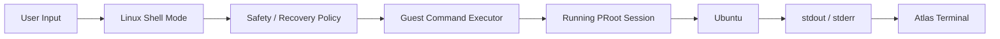

# Atlas Cyberdeck — Guest Command Execution

**Document type:** Engineering  
**Status:** Current  
**Release baseline:** `v0.13.0-alpha`

---

## Purpose

This document describes how commands entered while Ubuntu shell mode is active are executed inside the running Linux guest.

---

## Execution Path



---

## Shell Routing

Ubuntu shell routing occurs before ordinary Atlas command parsing.

Conceptually:

```text
if LinuxShellMode is active:
    exit → leave Ubuntu shell
    otherwise → guest executor
else:
    Atlas command pipeline
```

This prevents guest commands from being interpreted as Atlas commands.

---

## Command Submission

The guest executor receives:

- raw command text;
- runtime session;
- output callbacks;
- error callbacks;
- timeout policy;
- safety context.

It returns:

- stdout;
- stderr;
- exit code;
- runtime health implications.

---

## Streaming Output

Linux output is streamed while the command executes.

This is important for commands such as:

```text
apt update
apt install
dpkg --configure -a
```

because users need feedback during long operations.

---

## Timeouts

Atlas distinguishes ordinary commands from package operations.

Current behavior uses a shorter default timeout and a much longer package-operation timeout.

The purpose is to avoid:

- hanging forever;
- prematurely killing valid package operations.

---

## Output Capture

Output capture must remain bounded.

The executor maintains limits for captured data and command-completion markers so a command cannot grow application memory without limit.

---

## Completion Detection

The executor uses a command-completion marker to identify when the guest command has completed and to recover the exit code reliably.

The marker is an implementation detail and should not appear in normal user-facing output.

---

## Exit Codes

The guest command exit code is authoritative.

This is particularly important for package repair.

A later audit may report clean state, but it must not overwrite a failed original repair result.

---

## Runtime Death

If the underlying PRoot process disappears during execution, the executor must not report a normal command failure only.

Unexpected runtime loss may trigger:

```text
RUNTIME_PROCESS_LOST
```

and trip Atlas Safe Mode.

---

## Safety Gates

### Safe Mode

Guest command execution is blocked.

### Recovery Mode

Only commands approved by `LinuxRuntimeRecoveryPolicy` are permitted.

Disallowed commands return a recovery restriction message.

---

## Interactive Commands

Atlas does not currently provide a general PTY.

Commands requiring full terminal interactivity are guarded.

Examples:

```text
nano
vi
vim
top
```

The application should not pretend these commands work correctly through a non-PTY execution path.

---

## Package Commands

Package commands receive additional handling:

- explicit confirmation policy;
- preflight audit;
- post-transaction audit;
- package-integrity detection;
- extended timeout;
- recovery verification.

See:

`Package-Management.md`

---

## Concurrency

Guest commands execute asynchronously through coroutine-based work.

The Android UI thread should never wait synchronously for a long Linux command.

---

## Failure Behavior

The executor distinguishes:

```text
ordinary guest command failure
runtime process failure
package integrity failure
recovery policy denial
timeout
```

These failures should not be collapsed into a generic error.

---

## Testing

Validation includes:

- simple commands;
- streamed commands;
- package commands;
- shell exit;
- Safe Mode blocking;
- Recovery Mode restrictions;
- failed repair behavior;
- runtime death behavior.

---

## Related Documents

- `Linux-Runtime.md`
- `Package-Management.md`
- `Runtime-Safety.md`
- `Runtime-Recovery.md`
- `../adr/ADR-010-Atlas-Shell-vs-Ubuntu.md`
