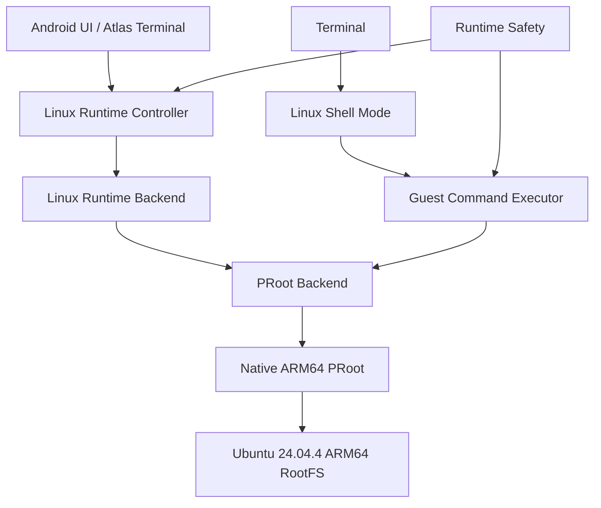
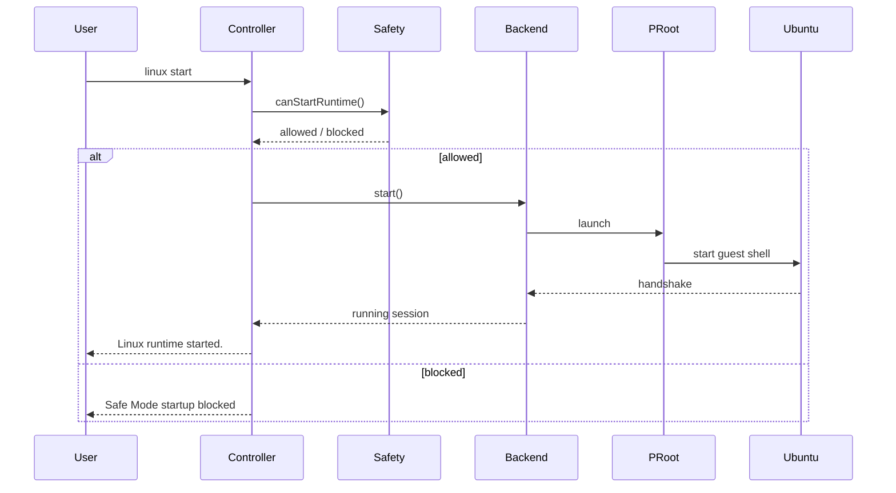

# Atlas Cyberdeck — Linux Runtime

**Document type:** Engineering  
**Status:** Current  
**Release baseline:** `v0.13.0-alpha`

---

## Purpose

This document describes the Linux runtime subsystem that allows Atlas Cyberdeck to run a persistent Ubuntu ARM64 userspace on Android without requiring Android root access.

The runtime is not a single process wrapper. It is a coordinated subsystem made up of capability checks, persistent installation state, native assets, path management, a runtime controller, a backend, PRoot launch logic, guest command execution, shell state, diagnostics, and runtime safety.

---

## Runtime Stack



---

## Current Runtime Profile

```text
Distribution : Ubuntu 24.04.4 LTS
Architecture : ARM64 / AArch64
Runtime      : PRoot
Guest UID    : 0
Home         : /root
Android Root : Not required
```

---

## Core Responsibilities

### Capability Detection

Atlas determines whether the current device can support the packaged runtime.

Responsibilities include:

- ABI detection;
- native asset availability;
- runtime feature gating;
- unsupported-device messaging.

### Installation State

`LinuxRepository` owns the persistent model describing whether Ubuntu is installed and what runtime state Atlas last recorded.

Repository state does not prove native process liveness.

### Runtime Controller

`LinuxRuntimeController` owns orchestration.

It coordinates:

```text
Safety
  ↓
Capability
  ↓
Installation
  ↓
Backend
  ↓
Session
```

Normal runtime start is denied when Atlas safety is `SAFE_MODE`.

### Runtime Backend

The backend separates application control logic from PRoot-specific implementation.

Current implementation:

```text
LinuxRuntimeBackend
        ↓
ProotLinuxRuntimeBackend
```

### Native Process

The PRoot process hosts the Ubuntu userspace.

Actual process state is authoritative for determining whether the runtime is alive.

---

## Start Flow



---

## Stop Flow

A runtime stop should:

- stop the active PRoot process;
- terminate guest child processes where applicable;
- clear active runtime session state;
- reconcile repository state;
- preserve RootFS data;
- preserve package state;
- preserve user data.

Stopping Linux is not the same as uninstalling Linux.

---

## Runtime Sessions

Runtime session state represents the currently active backend-owned Linux process.

The session should be invalidated when the PRoot process is no longer alive.

A stale application state such as:

```text
RUNNING
```

must not survive process death without reconciliation.

---

## Runtime Paths

Path management is centralized through the runtime path layer.

Major path categories include:

- runtime root;
- Ubuntu RootFS;
- native runtime binaries;
- loader assets;
- temporary PRoot data;
- persistent `.l2s` data;
- safety-state storage.

Path ownership should remain centralized to prevent individual features from inventing their own filesystem locations.

---

## Native Runtime

Current PRoot asset:

```text
libproot_atlas.so
```

Current loader asset:

```text
libproot_loader_atlas.so
```

Current PRoot version:

```text
5.1.107.92
```

The runtime is packaged for:

```text
arm64-v8a
```

---

## Launch Environment

The current launch architecture uses concepts including:

```text
--kill-on-exit
--link2symlink
-L
-0
-r <rootfs>
-b /dev
-b /proc
-b /sys
-w /root
/bin/sh
-l
```

Environment configuration includes:

```text
PROOT_L2S_DIR
PROOT_TMP_DIR
HOME
USER
LOGNAME
SHELL
TERM
LANG
LC_ALL
PATH
TMPDIR
TMP
TEMP
```

Guest temp variables point to:

```text
/tmp
```

Host-side PRoot temp storage remains separate.

---

## Linux Shell Mode

Atlas does not automatically route every command to Ubuntu when Linux is running.

Ubuntu shell mode is explicit:

```console
atlas@cyberdeck:~$ linux shell
Ubuntu shell mode enabled.
Type 'exit' to return to Atlas.

root@atlas:~#
```

`exit` leaves Ubuntu shell mode without unnecessarily destroying the runtime.

---

## Runtime Safety Integration

The runtime controller is safety-aware.

```text
NORMAL         → normal start allowed
SAFE_MODE      → normal start blocked
RECOVERY_ARMED → recovery start allowed
```

Recovery restrictions remain enforced by the guest executor.

---

## Diagnostics

Runtime diagnostics expose information such as:

- installation state;
- runtime state;
- native asset readiness;
- runtime storage;
- ABI;
- runtime safety;
- runtime access;
- safety reason;
- cleanup result.

---

## Failure Modes

Important failure classes include:

```text
runtime process lost
native asset missing
RootFS unavailable
runtime integrity failure
package-state failure
filesystem failure
guest health failure
```

Critical failures may trip the runtime circuit breaker.

---

## Testing

The Linux runtime is validated through:

```bash
./gradlew testDebugUnitTest
./gradlew assembleDebug
./gradlew installDebug
```

Native runtime behavior additionally requires physical-device validation.

---

## Related Documents

- `Ubuntu-RootFS.md`
- `Guest-Command-Execution.md`
- `Runtime-Networking.md`
- `Package-Management.md`
- `Runtime-Safety.md`
- `Runtime-Recovery.md`
- `Runtime-Testing.md`
- `../adr/ADR-006-Linux-Runtime-Architecture.md`
- `../adr/ADR-007-PRoot-Runtime.md`
