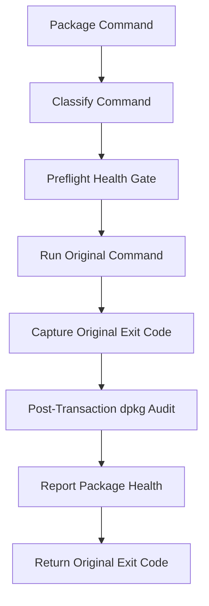

# Atlas Cyberdeck — Package Management

**Document type:** Engineering  
**Status:** Current  
**Release baseline:** `v0.13.0-alpha`

---

## Purpose

This document describes Atlas Cyberdeck package-management policy for Ubuntu.

Atlas uses standard Debian package tools but adds application-level safeguards around mutating package operations.

---

## Supported Package Tools

```text
apt
apt-get
dpkg
```

Example:

```console
root@atlas:~# apt install -y python3
...
Atlas package health: CLEAN
```

---

## Design Goals

Package handling should:

- respect explicit user intent;
- avoid hidden confirmation flags;
- detect dirty package state before mutation;
- audit package state afterward;
- preserve the original command result;
- escalate integrity failures;
- support controlled recovery.

---

## Package Transaction Flow



---

## Explicit Confirmation

Atlas does not silently append:

```text
-y
```

or:

```text
--assume-yes
```

to a mutating package command.

The user must explicitly request noninteractive confirmation.

---

## Noninteractive Environment

For supported package workflows, Atlas may configure a scoped noninteractive package environment so Android does not become trapped waiting for an interactive configuration dialog.

The environment must be scoped to the package command rather than permanently altering the guest shell.

---

## Preflight Health Gate

Before a normal package mutation, Atlas checks package health.

A dirty package database may block ordinary mutation.

Recovery commands are handled separately so the user can repair the package system.

---

## Post-Transaction Audit

After mutation, Atlas audits package state.

A successful audit can produce:

```text
Atlas package health: CLEAN
```

An audit problem produces a warning or failure report.

---

## Original Exit Status

The original package command exit status remains authoritative.

Example:

```text
repair command exit = 1
post-audit = CLEAN
```

Result:

```text
repair failed
```

not:

```text
repair succeeded
```

This rule exists because package audit state and command success are different facts.

---

## Package Integrity Failures

Atlas inspects package stderr/output for integrity failures that should escalate runtime safety.

Examples may include:

- dpkg database problems;
- filesystem failures during package extraction;
- ownership/link failures;
- package transaction corruption.

Critical failures can trip:

```text
PACKAGE_STATE_FAILURE
```

---

## Filesystem Compatibility

Package management depends on the PRoot compatibility layer.

Important runtime features include:

```text
--link2symlink
PROOT_L2S_DIR
/dev
/proc
/sys
guest /tmp
```

Package state must not be casually deleted during cleanup.

---

## Recovery Operations

Approved repair operations include:

```text
dpkg --configure -a
dpkg --configure --pending
apt --fix-broken install -y
apt --fix-broken install --assume-yes
apt-get -f install -y
apt-get --fix-broken install -y
apt-get --fix-broken install --assume-yes
```

Exact policy is maintained in the recovery layer.

---

## Audit-Only Commands

Example:

```text
dpkg --audit
```

This may be allowed for diagnostics.

It does not by itself clear recovery.

---

## Verified Recovery

Package recovery is considered verified only when:

```text
approved repair operation
AND
exitCode == 0
AND
post-audit == CLEAN
```

---

## Testing

Package validation includes:

- `apt update`;
- package install;
- Python installation/use;
- preflight clean state;
- post-transaction clean state;
- dirty-state blocking;
- failed repair behavior;
- recovery success;
- original exit-code preservation.

---

## Related Documents

- `Guest-Command-Execution.md`
- `Runtime-Safety.md`
- `Runtime-Recovery.md`
- `Ubuntu-RootFS.md`
- `../adr/ADR-009-Controlled-Recovery.md`
