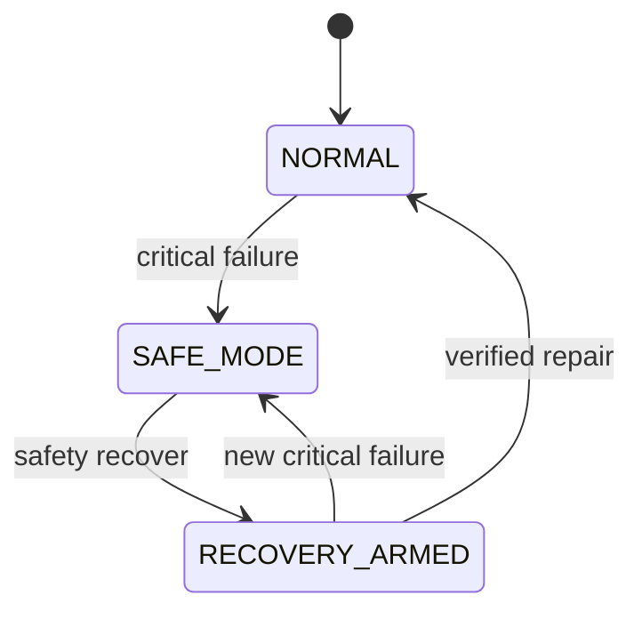
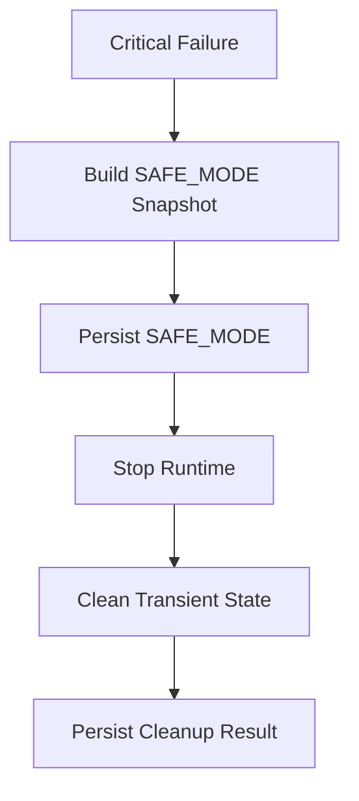

# Atlas Cyberdeck — Runtime Safety

**Document type:** Engineering  
**Status:** Current  
**Release baseline:** `v0.13.0-alpha`

---

## Purpose

This document describes the fail-closed safety architecture protecting the Atlas Cyberdeck Linux runtime.

---

## Safety States

```text
NORMAL
SAFE_MODE
RECOVERY_ARMED
```

User-facing names:

```text
Normal
Safe Mode
Recovery Mode
```

---

## State Diagram



---

## Safety Snapshot

The safety snapshot contains state such as:

```text
mode
reason
message
tripped timestamp
transient cleanup result
```

The snapshot is the authoritative runtime safety record.

---

## Safety Reasons

Current reasons include:

```text
RUNTIME_PROCESS_LOST
RUNTIME_INTEGRITY_FAILURE
GUEST_HEALTH_FAILURE
PACKAGE_STATE_FAILURE
FILESYSTEM_FAILURE
MANUAL_TEST
```

---

## State Machine

`LinuxRuntimeSafetyStateMachine` owns pure transition rules.

Responsibilities include:

```text
canStartRuntime
isRecoveryArmed
trip
withCleanupResult
armRecovery
reset
failClosed
```

It intentionally has no dependency on:

- Android;
- PRoot;
- filesystem;
- persistence;
- coroutines.

---

## Circuit Breaker

`LinuxRuntimeCircuitBreaker` owns side effects.

Responsibilities include:

- persist state;
- publish state;
- trip Safe Mode;
- stop PRoot;
- clean transient state;
- arm Recovery Mode;
- reset after verified recovery;
- fail closed on corrupt state.

---

## Trip Sequence



Persisting Safe Mode before stopping the runtime prevents a process failure from leaving Atlas appearing normal after restart.

---

## Fail Closed

If Atlas cannot read its safety record reliably:

```text
mode   = SAFE_MODE
reason = RUNTIME_INTEGRITY_FAILURE
```

Principle:

> **Unknown integrity fails closed.**

---

## Startup Gate

Normal Linux start must pass:

```text
LinuxRuntimeCircuitBreaker.canStartRuntime()
```

Result:

```text
NORMAL         → allowed
SAFE_MODE      → blocked
RECOVERY_ARMED → allowed for recovery
```

---

## Reactive State

Safety state is published with `StateFlow`.

Consumers include:

- Terminal;
- Linux Manager;
- app-wide safety banner;
- diagnostics;
- status;
- neofetch.

---

## UI Identity

```text
NORMAL / Atlas → standard Atlas theme
Ubuntu         → black + Matrix green
SAFE_MODE      → black + yellow
RECOVERY_ARMED → black + amber
```

Safety identity always wins over shell identity.

---

## Safety Commands

```text
safety status
safety recover
safety trip-test
safety reset --force
```

`trip-test` is for development validation.

`reset --force` is not equivalent to verified repair.

---

## Persistent vs Transient Data

Safety cleanup preserves:

```text
Ubuntu RootFS
user data
package database
package metadata
.l2s
Atlas virtual filesystem
```

Cleanup may remove only explicitly transient runtime state.

---

## Testing

Pure unit tests cover:

```text
NORMAL allows runtime
SAFE_MODE blocks runtime
RECOVERY_ARMED allows recovery runtime
trip → SAFE_MODE
armRecovery → RECOVERY_ARMED
reset → NORMAL
failClosed → SAFE_MODE
```

Device validation covers:

- runtime trip;
- actual PRoot shutdown;
- Safe Mode UI;
- start blocking;
- recovery arming;
- verified recovery.

---

## Related Documents

- `Runtime-Recovery.md`
- `Runtime-Testing.md`
- `Package-Management.md`
- `../adr/ADR-008-Runtime-Safety-Model.md`
