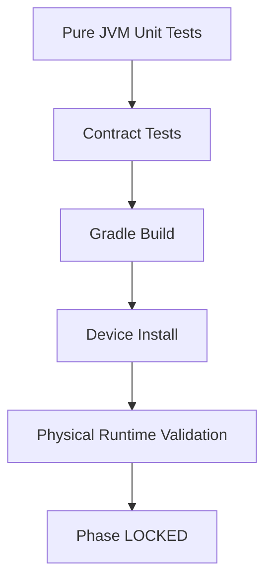

# Atlas Cyberdeck — Runtime Testing

**Document type:** Engineering  
**Status:** Current  
**Release baseline:** `v0.13.0-alpha`

---

## Purpose

This document describes how Atlas Cyberdeck validates Linux runtime behavior across pure JVM tests, command contracts, Gradle builds, and physical-device execution.

---

## Testing Layers



---

## Pure JVM Tests

Best for deterministic policy.

Examples:

- safety state machine;
- package policy;
- recovery policy;
- parsing;
- registries;
- command metadata.

Pure tests should not require:

```text
Android Context
native binaries
PRoot
runtime filesystem initialization
physical device
```

---

## Contract Tests

Some important regressions are easier to protect by testing the command/source contract rather than executing Android-coupled runtime singletons.

Current example:

`UtilityCommandsTest.kt`

Protects:

- `linux shell`;
- Safe Mode shell branch;
- Recovery Mode shell branch;
- Linux usage text;
- startup blocking contract.

---

## Why Contract Tests Exist

An earlier test design attempted to directly execute runtime singleton behavior inside local JVM tests.

That failed because Android/runtime path initialization was unavailable.

The corrected design protects the public command contract without pretending the full Android runtime exists inside JUnit.

---

## Safety State-Machine Tests

`LinuxRuntimeSafetyStateMachineTest.kt` validates pure transitions such as:

```text
NORMAL allows runtime
SAFE_MODE blocks runtime
RECOVERY_ARMED allows runtime
trip creates SAFE_MODE
armRecovery creates RECOVERY_ARMED
reset creates NORMAL
failClosed creates SAFE_MODE
```

This is the preferred pattern for safety policy.

---

## Build Validation

Standard commands:

```bash
./gradlew testDebugUnitTest
./gradlew assembleDebug
```

Physical-device install:

```bash
./gradlew installDebug
```

---

## Device Validation

Required for:

- native PRoot startup;
- Ubuntu RootFS launch;
- shell entry/exit;
- Android filesystem semantics;
- DNS synchronization;
- `apt`;
- package installation;
- package recovery;
- process death;
- Safe Mode;
- Recovery Mode;
- Compose/runtime integration.

---

## Runtime Smoke Tests

Representative runtime smoke sequence:

```text
linux status
linux start
linux shell
pwd
whoami
cat /etc/os-release
uname -m
python3 --version
exit
diagnostics
status
neofetch
```

---

## Package Smoke Tests

Representative:

```text
apt update
apt install -y python3
dpkg --audit
```

Expected post-transaction result:

```text
Atlas package health: CLEAN
```

---

## Safety Smoke Tests

Representative developer flow:

```text
safety status
safety trip-test
linux start
safety recover
linux start
linux shell
dpkg --configure -a
dpkg --audit
exit
safety status
```

Expected end state after verified repair:

```text
Mode    : NORMAL
Tripped : NO
Runtime : ENABLED
```

---

## Regression Principles

A regression test should protect a behavior that previously failed or is costly to lose.

Examples:

```text
linux shell remains available
Safe Mode blocks startup
failed repair cannot clear recovery
corrupt state fails closed
```

Avoid tests that only mirror implementation syntax without protecting a meaningful contract.

---

## Phase Lock Criteria

A runtime-critical phase should not be marked LOCKED until appropriate checks are green.

```text
Unit tests      → GREEN
Build           → GREEN
Device behavior → validated
Regression risk → protected where practical
Phase           → LOCKED
```

---

## CI Role

CI validates deterministic repository behavior.

CI does not replace physical-device runtime proof.

Current CI can validate:

- compilation;
- JVM tests;
- source/contract tests;
- deterministic build logic.

---

## Related Documents

- `Linux-Runtime.md`
- `Runtime-Safety.md`
- `Runtime-Recovery.md`
- `Package-Management.md`
- `../adr/ADR-004-Testing-Strategy.md`
- `../adr/ADR-005-Continuous-Integration.md`
