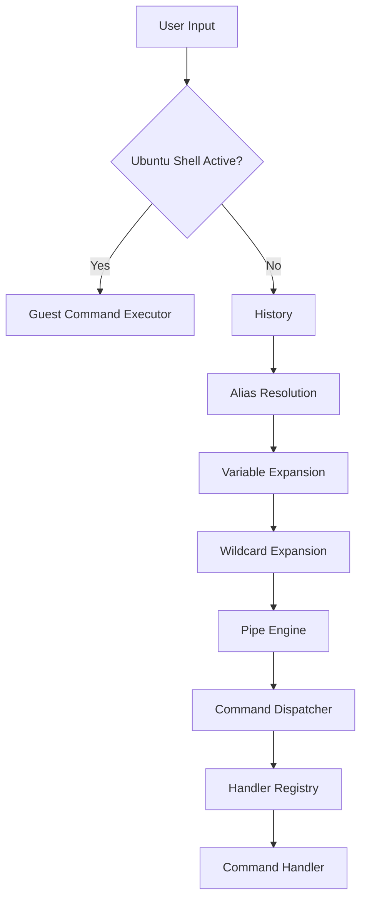

# Atlas Cyberdeck — Terminal Engines

**Document type:** Engineering  
**Status:** Current  
**Release baseline:** `v0.13.0-alpha`

---

## Purpose

This document describes the processing engines that make up the Atlas shell.

The terminal is not implemented as one monolithic parser. Input passes through focused components responsible for expansion, routing, execution, scripting, and guest-shell mode.

---

## High-Level Flow



---

## Terminal Command Processor

`TerminalCommandProcessor` is the orchestration boundary for Atlas terminal input.

Its responsibility is to coordinate processing—not to implement every command directly.

It should remain thin enough that command behavior can evolve independently.

---

## Shell Mode Routing

Before ordinary Atlas parsing, the processor checks whether Ubuntu shell mode is active.

If active:

```text
exit
```

returns to the Atlas shell.

Other input is routed to the guest command executor.

This ordering is important because commands such as:

```text
pwd
whoami
ls
```

exist in both environments.

---

## Command History

The history engine records prior Atlas commands and supports recall.

Responsibilities include:

- storing command entries;
- navigating backward and forward;
- exposing history to the `history` command;
- preserving a predictable editing experience.

History should not silently execute recalled commands.

---

## Alias Resolution

Aliases map short user-friendly forms to canonical Atlas commands.

Example:

```text
ll → ls
```

Alias resolution occurs before dispatch so downstream components operate on the intended command.

Aliases should not create hidden privilege or safety bypasses.

---

## Variable Expansion

Environment variables can be expanded before command dispatch.

Conceptually:

```text
$NAME
```

is resolved from Atlas shell environment state.

Atlas environment variables are not automatically identical to Ubuntu environment variables.

---

## Wildcard Expansion

Wildcard handling expands supported path patterns against the Atlas virtual filesystem.

This occurs before handlers receive final path arguments.

Wildcard expansion should respect:

- current working directory;
- Atlas VFS semantics;
- no-match behavior;
- quoting rules supported by the shell.

---

## Pipe Engine

The pipe engine connects command output to later command input.

Example:

```text
cat data.txt | grep Atlas | sort
```

Pipeline execution should use command contracts rather than bypassing the dispatcher.

---

## Command Dispatcher

The dispatcher routes a parsed command to the appropriate registered handler.

Conceptually:

```text
command name
    ↓
handler registry
    ↓
matching handler
    ↓
execution
```

The dispatcher should not need to know implementation details for every command family.

---

## Handler Registry

The handler registry owns handler discovery and registration.

Current command groups include concepts such as:

```text
Utility
File
Directory
Text
```

Linux-related controls are integrated through the terminal command architecture while preserving runtime safety.

---

## Script Engine

Atlas `.ash` scripts execute through the existing terminal architecture.

That means script commands receive the same:

- command dispatch;
- filesystem state;
- aliases;
- parsing behavior;
- safety controls;

as interactive Atlas commands where applicable.

A script should not create a secret second command engine.

---

## Plugin Registry

The plugin framework provides a future extension point for terminal capability.

Current foundations include:

```text
TerminalPlugin
PluginInfo
PluginRegistry
plugin initialization
installed plugin discovery
```

Dynamic external plugin loading is future work.

---

## Linux Shell Mode

`LinuxShellMode` maintains the user-facing Ubuntu shell state.

Responsibilities include:

- verifying runtime availability;
- entering shell mode;
- maintaining guest working directory display;
- rendering Ubuntu prompt;
- leaving shell mode on `exit`;
- preserving runtime after shell exit.

Prompt:

```text
root@atlas:~#
```

---

## Safety Interaction

### Safe Mode

Ubuntu shell entry is blocked.

Atlas shell remains available.

### Recovery Mode

Ubuntu shell entry may be permitted, but guest commands are restricted by the recovery policy.

---

## Separation of Responsibilities

```text
TerminalCommandProcessor → orchestration
CommandRegistry          → metadata
CommandDispatcher        → routing
HandlerRegistry          → handler lookup
CommandHandler           → command behavior
ScriptEngine             → script sequencing
LinuxShellMode           → guest shell state
Guest Executor            → Ubuntu command execution
```

---

## Failure Behavior

The terminal should distinguish:

- unknown Atlas command;
- invalid arguments;
- filesystem failure;
- Linux runtime unavailable;
- Safe Mode block;
- Recovery Mode restriction;
- guest command failure.

Do not collapse all failures into a generic message.

---

## Testing

Terminal-engine validation includes:

- dispatcher behavior;
- registry behavior;
- script execution;
- alias resolution;
- pipeline behavior;
- command completion;
- Linux command contracts;
- Atlas/Ubuntu shell switching;
- Safe Mode shell blocking.

---

## Design Rule

> **The terminal processor coordinates engines; it does not become every engine.**

---

## Related Documents

- `Command-Completion.md`
- `VirtualFileSystem-Orchestrator.md`
- `Guest-Command-Execution.md`
- `../adr/ADR-002-Terminal-Architecture.md`
- `../adr/ADR-010-Atlas-Shell-vs-Ubuntu.md`
