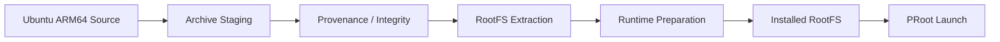

# Atlas Cyberdeck — Ubuntu RootFS

**Document type:** Engineering  
**Status:** Current  
**Release baseline:** `v0.13.0-alpha`

---

## Purpose

This document describes how Atlas Cyberdeck sources, stages, provisions, preserves, and launches its Ubuntu ARM64 root filesystem.

---

## Current RootFS

```text
Distribution : Ubuntu 24.04.4 LTS
Architecture : ARM64 / AArch64
Home         : /root
Guest UID    : 0
```

Source archive:

```text
ubuntu-base-24.04.4-base-arm64.tar.gz
```

Current source:

```text
https://cdimage.ubuntu.com/ubuntu-base/releases/24.04/release/
```

---

## RootFS Lifecycle



---

## Source Definition

Atlas keeps the Ubuntu source definition explicit rather than embedding download assumptions throughout the runtime code.

The source record includes:

- distribution identity;
- release;
- architecture;
- archive URL;
- expected integrity metadata.

---

## Staging

The archive is staged before extraction.

Staging allows Atlas to distinguish:

```text
source acquisition
archive presence
archive validation
RootFS extraction
runtime readiness
```

This separation improves diagnostics and avoids treating a partially prepared installation as complete.

---

## Provenance

Atlas tracks the source and integrity of runtime assets.

RootFS provenance is useful for:

- diagnostics;
- reproducibility;
- verifying the intended Ubuntu image;
- future update workflows;
- detecting unexpected runtime changes.

---

## Persistent RootFS

The Ubuntu RootFS is persistent.

Atlas does not recreate the RootFS every time Linux starts.

Persistent content includes:

- installed packages;
- `/root` user files;
- package database;
- configuration;
- shell state stored inside the guest;
- `.l2s` compatibility state.

---

## Runtime Preparation

Before launch, Atlas prepares required runtime paths and environment.

Important guest mounts include:

```text
/dev
/proc
/sys
```

The guest working directory is:

```text
/root
```

---

## Package-State Preservation

Atlas must preserve Debian package state across normal runtime stops and recoverable failures.

Important state includes:

```text
/var/lib/dpkg
/var/lib/apt
/etc/apt
.l2s
```

Recovery cleanup must not treat package metadata as disposable cache.

---

## Guest Root vs Android Root

Inside the Ubuntu guest, PRoot presents:

```text
uid=0
```

This is guest userspace behavior.

It does not provide root privileges over Android.

Atlas should describe this as:

> Root inside the Ubuntu guest; Android root is not required.

---

## Removal

Removing Linux is a destructive lifecycle operation distinct from stopping Linux.

A future polished removal workflow should clearly explain that deleting the RootFS removes:

- installed Linux packages;
- guest configuration;
- guest user files;
- guest package state.

Removal should remain explicitly user-initiated.

---

## Failure Handling

RootFS integrity or filesystem failures can trigger runtime safety.

Atlas should prefer:

```text
preserve → block → diagnose → recover
```

over:

```text
delete → reinstall
```

when recovery is possible.

---

## Testing

RootFS validation includes:

- successful provisioning;
- guest handshake;
- `/etc/os-release`;
- `uname -m`;
- persistence across stop/start;
- package installation;
- package-state preservation;
- recovery after package problems.

---

## Related Documents

- `Linux-Runtime.md`
- `Package-Management.md`
- `Runtime-Safety.md`
- `Runtime-Recovery.md`
- `../adr/ADR-003-Persistence.md`
- `../adr/ADR-007-PRoot-Runtime.md`
