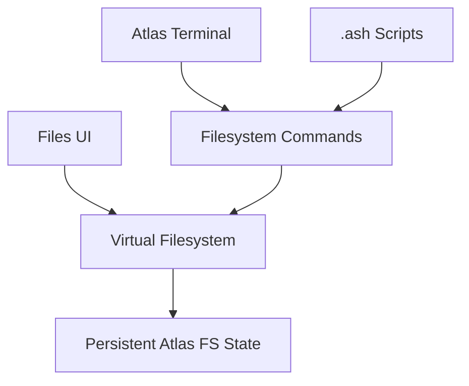

# Atlas Cyberdeck — Virtual Filesystem Orchestrator

**Document type:** Engineering  
**Status:** Current  
**Release baseline:** `v0.13.0-alpha`

---

## Purpose

This document describes the Atlas virtual filesystem orchestration layer.

The Atlas VFS provides a persistent application-level filesystem for the Atlas shell and remains independent of the Ubuntu RootFS.

---

## Architectural Position



---

## Why Atlas Has Its Own Filesystem

Atlas must remain useful when:

- Ubuntu is not installed;
- Linux is stopped;
- Linux is blocked by Safe Mode;
- the device cannot use the Linux runtime.

Therefore:

> **The Atlas VFS is not the Ubuntu RootFS.**

---

## Core Responsibilities

The VFS owns:

- filesystem hierarchy;
- file records;
- directory records;
- current working directory;
- path normalization;
- relative path resolution;
- persistent state;
- filesystem operations.

---

## Current Operations

Supported concepts include:

```text
pwd
cd
ls
touch
cat
mkdir
rmdir
rm
cp
mv
find
tree
```

Text-processing commands may consume file content through the VFS.

---

## Working Directory

The Atlas shell maintains its own working directory.

Example:

```text
atlas@cyberdeck:~$
```

The displayed Atlas path is not automatically mapped to:

```text
/root
```

inside Ubuntu.

---

## Path Resolution

A filesystem operation should resolve paths in a consistent sequence:

```text
input path
    ↓
absolute or relative?
    ↓
resolve against working directory
    ↓
normalize
    ↓
validate
    ↓
perform operation
```

---

## Relative Paths

Relative path behavior should be predictable across interactive commands and scripts.

Example:

```text
mkdir Project
cd Project
touch notes.txt
```

The second and third operations use the current VFS state created by earlier commands.

---

## Persistence

VFS state persists independently of Linux runtime state.

A Linux process stop must not erase the Atlas VFS.

A Safe Mode trip must not erase the Atlas VFS.

A Linux uninstall should not erase the Atlas VFS unless a separate explicit product workflow is defined.

---

## Script Integration

`.ash` scripts operate on the same VFS used by interactive Atlas commands.

This allows:

```text
mkdir Project
cd Project
touch hello.txt
echo Atlas > hello.txt
cat hello.txt
```

to preserve filesystem state across script commands.

---

## Command Completion Integration

Path completion should query the Atlas VFS when Atlas shell mode is active.

This keeps path completion synchronized with actual Atlas filesystem state.

---

## Files UI Integration

The Files screen should render authoritative VFS state rather than maintaining an unrelated parallel filesystem model.

UI operations should delegate to the filesystem/domain layer.

---

## Filesystem Search

Search should operate over normalized Atlas paths and return deterministic VFS results.

The search layer should not unexpectedly scan the Android host filesystem.

---

## Tree Visualization

Tree output is a presentation of Atlas VFS hierarchy.

It should not require Ubuntu or native runtime availability.

---

## Error Handling

Filesystem errors should identify the actual condition where practical.

Examples:

```text
path not found
directory already exists
file already exists
not a directory
directory not empty
invalid path
```

Avoid generic filesystem failure messages when a more specific result is available.

---

## Safety Boundary

The VFS is application data.

Runtime recovery cleanup should not remove Atlas VFS state.

This is a key boundary between:

```text
Atlas application workspace
```

and:

```text
Ubuntu runtime workspace
```

---

## Future Bridging

Future features may intentionally move files between Atlas and Ubuntu.

Such bridging should be explicit.

Examples might include:

```text
export to Ubuntu
import from Ubuntu
shared project workspace
```

The architecture should not silently merge the two filesystems.

---

## Testing

VFS tests should cover:

- root state;
- path normalization;
- relative paths;
- working-directory changes;
- create/read/write;
- copy;
- move;
- rename;
- delete;
- directory operations;
- search;
- persistence;
- script state continuity.

---

## Design Rule

> **Atlas filesystem state belongs to Atlas, not to the Linux runtime.**

---

## Related Components

- virtual filesystem implementation
- filesystem command handlers
- Files UI
- ScriptEngine
- command completion

---

## Related Documents

- `Command-Completion.md`
- `Terminal-Engines.md`
- `Linux-Runtime.md`
- `../adr/ADR-001-Filesystem-Architecture.md`
- `../adr/ADR-003-Persistence.md`
- `../adr/ADR-010-Atlas-Shell-vs-Ubuntu.md`
